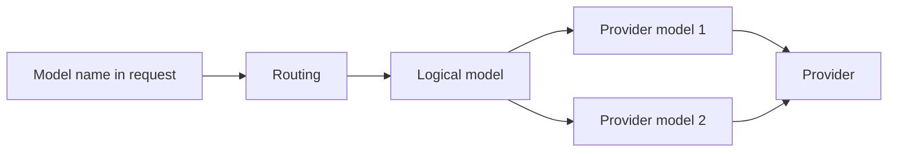

# Core concepts

The console reuses a handful of words. Sort them out first, and the rest of the pages read easily.

## Logical model

A **logical model** is the landing point of routing, and the model name written in a client request. It is not a real model itself — just a name, with a batch of real provider models hanging under it.

- After a request hits a logical model, the provider models under it do the real work.
- The built-in `default` logical model is the **catch-all**: any request that matches no policy lands here. It cannot be renamed or deleted (its description is editable).
- A logical model card has two modes: **failover** (try the attached models in order) and **manual pin** (fix on one, the rest on standby).

See [Logical models](/logical-models) for details.

## Providers and provider models

- **Provider**: one upstream service, such as OpenAI, DeepSeek, or a self-hosted cluster. Credentials (API key), default base URL, and request timeout live at this level.
- **Provider model**: one real model under a provider (e.g. `gpt-4.1-mini`). It is the party actually called, and the thing a logical model attaches.

A provider model can declare support for several **protocols** (one model row, several endpoints); it always occupies a single row in the queue. See [Providers & models](/providers).

## Protocols and transport modes

- **Protocol**: the language a request speaks. This service accepts OpenAI Chat Completions, OpenAI Responses, and Anthropic Messages (see [Supported protocols](/protocols)).
- **Transport mode**: non-streaming, streaming, or WebSocket. Whether a request streams is decided by the request itself.

**Protocol conversion** is optional: by default there is none, and requests pass through as-is. Only once an endpoint explicitly enables conversion can it accept requests in another protocol (a compatibility layer, where some parameters may be lost).

## Routing

**Routing** answers "which logical model does a request land on". It has two modes, and only one is in effect at a time:

- **Workflow orchestration**: a node graph on a canvas, able to express branches, loops, scripts, and LLM decisions.
- **Routing rules**: a rule table read in order; the first matching rule with a landing point wins, and if nothing matches, the catch-all is used.

See [Request routing](/routing) for details.

## Failover and cooldown

**Failover** means that when a provider fails, the next candidate is tried automatically. **Cooldown** means that after consecutive failures reach a threshold, the provider (or that provider model) is temporarily removed from the candidates and brought back after a while.

By default, three consecutive failures trigger cooldown; it starts at 30 seconds, grows with the number of failures, and is capped at 5 minutes. See [Failover](/failover).

## Cache affinity

**Cache affinity** keeps requests from the same conversation pinned as much as possible to the last successful provider model, to protect the provider-side prompt cache. See [Cache affinity](/cache-affinity).

## All of it in one line

The model name a client writes → routing decides which **logical model** it lands on → the logical model picks a **provider model** via **failover** → the provider model is sent to the **provider** over a **protocol**.

---

With the concepts clear, go configure your first upstream in [Providers & models](/providers).
