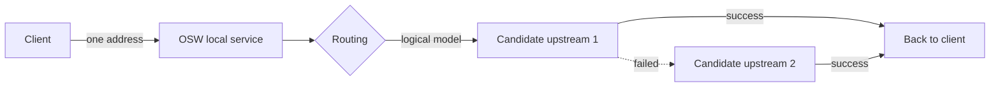

# What is OSW

OSW is an AI gateway that runs on your own machine. It starts a local HTTP service, and all your AI clients point at that one address; requests are forwarded through it to the upstream model services you configure, and when an upstream fails, the next one is tried automatically.

It solves a very concrete problem: when you have several model services (different vendors, different keys, different quotas), each client carries its own pile of addresses and secrets, and when one goes down you fix them by hand. OSW gathers all of that into one layer, so clients only ever need to know a single address.

<CardGroup cols={2}>
  <Card title="One address, many upstreams" icon="Waypoints" href="/upstreams/providers">
    Clients always point at `http://127.0.0.1:9300`. Swap upstreams or add more, and clients never change.
  </Card>
  <Card title="Automatic failover" icon="HeartPulse" href="/upstreams/failover">
    Network errors, timeouts, rate limits, and 5xx responses fail over to the next candidate; the successful attempt still returns its result to the client.
  </Card>
  <Card title="Per-request routing" icon="GitBranch" href="/upstreams/routing">
    Use rules or a workflow to decide which logical model a request lands on: split by source, model name, or protocol.
  </Card>
  <Card title="Visible by default" icon="Activity" href="/observability/request-logs">
    Which upstream each request took, how many times it failed over, and where the time went are all recorded in request logs and analytics.
  </Card>
</CardGroup>

## The journey of a request

1. The client sends a request to the local address (the protocol can be OpenAI or Anthropic — see [Supported protocols](/getting-started/protocols)).
2. OSW uses the currently active [routing definition](/upstreams/routing) to decide which **logical model** the request lands on.
3. Under that logical model hang several **provider models** (real upstreams); one is chosen by priority / failover to make the request.
4. When an upstream fails in a retryable way, the next candidate is tried; a successful response (including streaming) is handed back to the client as-is.

## What it is not

OSW is a **local** gateway. It does not run as a cloud service, and it does not take over your system network. A few boundaries up front:

<Callout title="Boundaries" type="warning">
- No system-level proxy: clients must explicitly point at the local service; OSW does not hijack system traffic.
- No client-side auth check: any non-empty key works at the local address. The real secret is substituted by OSW when forwarding.
- Cross-upstream protocol conversion is a **compatibility layer**: only endpoints where you explicitly enable conversion are eligible for cross-protocol requests, and some parameters may be lost (see [Supported protocols](/getting-started/protocols)).
</Callout>

Ready to go further? Start with [Install & run](/getting-started/installation), or jump straight to [Three steps to a gateway](/getting-started/quick-start).
