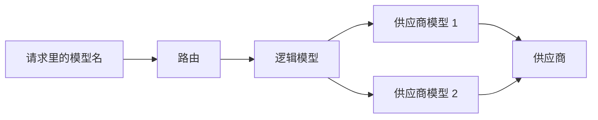

# 核心概念

控制台反复用到几个词，先把它们分清，后面的页面才好读。

## 逻辑模型

**逻辑模型**是路由的落点，也是客户端请求里写的那个模型名。它本身不是一个真实模型，只是一个名字，下面挂着一批真实的供应商模型。

- 请求命中某个逻辑模型后，由它下面的供应商模型真正去跑。
- 内置的 `default` 逻辑模型是**兜底**：没命中任何策略的请求都落到这里。它不能被改名或删除（说明可以编辑）。
- 逻辑模型卡片的两种模式：**故障转移**（在下挂的模型里按顺序试）与**手动指定**（固定用一个，其余待命）。

详见[逻辑模型](/upstreams/logical-models)。

## 供应商与供应商模型

- **供应商（Provider）**：一家上游服务，比如 OpenAI、DeepSeek、某自建集群。凭据（API Key）、默认接口地址、请求超时都记在供应商这一层。
- **供应商模型**：供应商下的一个真实模型（如 `gpt-4.1-mini`）。它是真正被调用的一方，也是逻辑模型里挂载的对象。

一个供应商模型可以声明支持多个**协议**（同一行模型，多个端点），它始终只占队列里的一行。详见[供应商与模型](/upstreams/providers)。

## 协议与传输形态

- **协议**：请求说哪种话。本服务接受 OpenAI Chat Completions、OpenAI Responses、Anthropic Messages 三种（见[本服务支持的协议](/getting-started/protocols)）。
- **传输形态**：非流式、流式、WebSocket。是否流式由请求本身决定。

**协议转换**是可选能力：默认不转换、原样透传。只有当某个端点显式开启转换后，它才可能接住其他协议的请求（兼容层，部分参数可能丢失）。

## 路由

**路由**回答「一条请求落到哪个逻辑模型」。它有两种模式，同一时刻只有一种生效：

- **工作流编排**：画布上的节点图，能表达分支、循环、脚本与 LLM 判定。
- **路由规则**：一张按顺序读的规则表，第一条命中且有落点的胜出，都不命中走兜底。

详见[请求选路](/upstreams/routing)。

## 故障转移与冷却

**故障转移**指某个供应商失败时自动改试下一个候选。**冷却**指连续失败达到阈值后，把该供应商（或该供应商模型）暂时移出候选，过一段时间再放回来。

默认连续失败 3 次进入冷却，初始冷却 30 秒、随失败次数递增、上限 5 分钟。详见[故障转移](/upstreams/failover)。

## 缓存亲和

**缓存亲和**让同一会话的请求尽量粘在最近一次成功的供应商模型上，以保护供应商侧的提示词缓存。详见[缓存亲和](/upstreams/cache-affinity)。

## 一句话串起来

客户端写的模型名 → 路由决定落到哪个**逻辑模型** → 逻辑模型按**故障转移**选中一个**供应商模型** → 供应商模型经**协议**发往**供应商**。

---

概念清楚了，去[供应商与模型](/upstreams/providers)配第一个上游。
