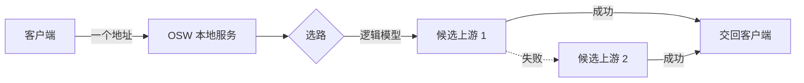

# OSW 是什么

OSW 是一个跑在你本机的 AI 网关。它在本地起一个 HTTP 服务，你所有的 AI 客户端都指向这一个地址；请求经它转发到你配置的上游模型服务，并且在某个上游失败时自动改试下一个。

它解决的问题很具体：当你手上有多个模型服务（不同厂商、不同 Key、不同额度），客户端里各自配一堆地址和密钥，一个挂了要手动去改。OSW 把这些收拢到一层，客户端只需要认一个地址。

<CardGroup cols={2}>
  <Card title="一个地址，多个上游" icon="Waypoints" href="/upstreams/providers">
    客户端固定指向 `http://127.0.0.1:9300`，上游换谁、加几个，客户端都不用动。
  </Card>
  <Card title="失败自动改试" icon="HeartPulse" href="/upstreams/failover">
    网络错误、超时、限流、5xx 会自动切到下一个候选，成功的那次照常把结果交回客户端。
  </Card>
  <Card title="按请求选路" icon="GitBranch" href="/upstreams/routing">
    用规则或工作流决定一条请求落到哪个逻辑模型：可以按来源、模型名、协议分流。
  </Card>
  <Card title="看得见" icon="Activity" href="/observability/request-logs">
    每一次请求走了哪个上游、切了几次、耗在哪，请求记录与统计里都留痕。
  </Card>
</CardGroup>

## 一段请求的旅程

1. 客户端把请求发到本地地址（协议可以是 OpenAI 或 Anthropic，见[本服务支持的协议](/getting-started/protocols)）。
2. OSW 按当前生效的[路由定义](/upstreams/routing)决定这条请求落到哪个**逻辑模型**。
3. 逻辑模型下挂着若干**供应商模型**（真实上游），按优先级/故障转移选择一个发起请求。
4. 上游失败且属于可改试的失败时，换下一个候选；成功的响应（含流式）原样交回客户端。

## 它不是什么

OSW 是**本地**网关，不外挂云服务，也不接管你的系统网络。几条边界先划清：

<Callout title="边界" type="warning">
- 不提供系统级代理：客户端要显式把地址配到本地服务，OSW 不会劫持系统流量。
- 不校验客户端鉴权：本地地址填任意非空 Key 即可，真正的密钥由 OSW 转发时替换。
- 上游之间的协议转换是**兼容层**：只有你显式开启转换的端点才会被用于跨协议，且可能丢失部分参数（见[本服务支持的协议](/getting-started/protocols)）。
</Callout>

确定要往下走了？从[安装与启动](/getting-started/installation)开始，或者直接跳[三步搭好网关](/getting-started/quick-start)。
