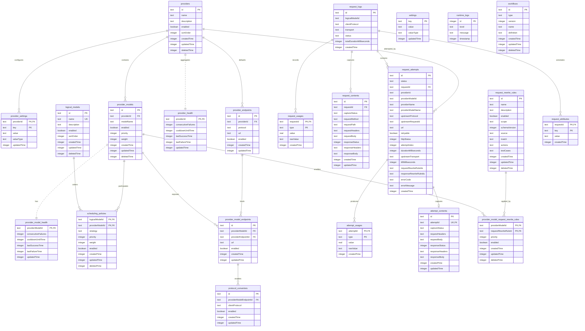

# OSW v0.3 数据模型设计

> 本文是新大版本的目标数据库结构。
>
> **发布策略：迁移优先，换代只在大版本发布时发生。** 结构变化默认加一条迁移（`packages/core/drizzle/<role>/` 下每个目录是一条，启动时按目录名顺序执行）；只有应用大版本发布时才把 `DATABASE_SCHEMA_VERSIONS` 里对应角色那个数字加一，以换文件名的方式甩掉累积的迁移历史——那时才会在一个全新的空文件上初始化，旧文件既不读取、不迁移、不检测。
> 数据库由**两个**文件组成：用户写的配置和系统写的观测数据各自独立（理由见 §2.1）。

## 1. 设计目标

OSW 的配置内容会持续增加，尤其是供应商、模型端点、认证方式、路由策略和模型能力。因此本版本遵循以下原则：

1. **稳定身份、关系、枚举、开关、数值和查询字段使用独立列。**
2. **只有真正开放、低频、非路由的扩展数据才使用 JSON；JSON 不是标准字段的默认容器。**
3. **多值且具有独立生命周期的内容使用子表，不使用数组 JSON。**
4. **运行时状态与用户配置分离。**
5. **请求日志中的统计指标和常用快照使用独立列；协议私有且不稳定的原始详情才使用 JSON。**
6. **请求/响应正文与日志索引分离，正文按需记录并完整保留。**
7. **历史日志不依赖可变配置，不为日志快照增加外键。**
8. **配置文档使用 `schemaVersion`，配置结构变化通过文档升级解决。**
9. **数据库结构以 Drizzle schema 为唯一代码定义，由生成的 migration 在应用启动时执行；不提供兼容迁移。**
10. **所有时间戳字段均为 Unix 毫秒（`Date.now()`），不使用秒。**
11. **表名统一为 `settings`，不再引入 `app_config` 作为数据库表名。**
12. **领域前缀按对象边界使用：`provider*` 是配置身份，`client*` 是客户端一侧，`upstream*` 是实际远端 hop。**
13. **请求级协议是 `clientProtocol`；每次 attempt 保存自己的 `upstreamProtocol`。**
14. **一张表 = 一个视角。列名不带视角前缀——视角由表名唯一确定。**
15. **事实永远写入，载荷才受开关控制。** `captureRequestContent` 只决定是否保存正文；是否发生协议转换、命中的改写规则 id、尝试耗时、TTFT、上游跳形态都是**事实**，无论开关如何都必须落库。
16. **用户写的和系统写的分两个文件。** 配置是用户资产（删了就没了），观测数据是系统副产品（删了就重新长出来）；两者的生命周期、备份价值、损坏后果、写放大容忍度都不同，所以它们不共用一个数据库文件。两个文件之间**不建外键**，跨文件一致性靠「配置是事实来源 + 观测侧惰性创建 + 启动时清理孤儿行」维持（见 §2.1）。

### 1.1 术语边界

`Provider` 是配置实体，不等同于运行时 upstream。一次 upstream 可能直接指向 Provider，也可能经过协议转换器、兼容层或其他中间目标。因而：

- `providerId`、`providerModelId`、`providerName` 和 `providerModelName` 仅用于配置身份或历史快照；
- `clientProtocol`、`clientRequest*` 和 `clientResponse*` 描述客户端边界；
- `upstreamProtocol`、`upstreamRequest*` 和 `upstreamResponse*` 描述实际远端 HTTP hop；
- `request_attempts` 只保存一次 attempt 的 upstream 事实快照；
- **协议转换是派生事实，不单独建表**：`clientProtocol` ≠ `request_attempts.upstreamProtocol` 即说明发生了转换，上游跳以什么形态回来由 `request_attempts.upstreamTransport` 表达。转换不需要第三张表，因为第三张表只能重复保存前两张表已有的信息；
- 客户端视角载荷归 `request_contents`，上游视角载荷归 `attempt_contents`；
- 用量也按视角拆表：请求级用量归 `request_usages`，尝试级用量归 `attempt_usages`。**不存在用可空列判别归属的行**——如果一行的含义取决于某列是否为空，那它其实是两张表；
- 正文表的一行只属于一个视角，因此表名即视角，列名不再带 `client` / `upstream` 前缀。

## 2. 数据库总览

数据目录里有两个同代的文件，共 22 张核心表：

| 文件 | 角色 | 表数 | 谁写 | 丢了会怎样 |
| --- | --- | --- | --- | --- |
| `config-<v>.db` | 配置库 | 12 | 用户 | 供应商、模型、路由、改写规则全没了——**不可再生** |
| `data-<v>.db` | 数据库 | 10 | 系统 | 历史请求、日志与健康状态归零，代理照常工作——**可丢弃** |

文件名里的 `<v>` 是**该库自己的 schema 版本号**，不是应用版本号；两个数字各自独立地写在 `packages/contracts/source/database-file.ts`（`DATABASE_SCHEMA_VERSIONS`），该文件是这条规则的唯一实现。**它只在应用大版本发布时加一**，且这一下必须与「重新生成首发基线、丢掉旧链」一起做：换名字就是换文件，新文件从干净基线建起，旧文件既不读取也不删除。**日常改结构不走这条路，加一条迁移就好**——把每次加列都做成换代，等于每加一列就让用户在一张空表上重新开始。两个库的版本各自独立，可以停在不同的数字上。

两条路的代价完全不同，选错了会直接伤到用户：**加迁移**保留用户已有数据，只是启动时多跑几条语句；**换代**则让配置库从空文件重新开始——用户自己写的供应商、模型、路由、规则不会跟过来，界面上只剩 seed 出来的默认逻辑模型，旧文件原地留着但不读。所以配置库加一只有一个正当理由：应用大版本发布、要甩掉迁移历史。为了给某次加列省一条迁移而换代，是拿用户的配置当耗材。

两个文件各有一条 Drizzle migration 链，分别落在 `packages/core/drizzle/config/` 与 `packages/core/drizzle/data/`（drizzle-kit 一份配置只能喂一条链，所以是两份 `drizzle.config.<role>.ts`）。链的形态是 drizzle-kit 1.0 的约定，与 0.x 不同：`drizzle/<role>/` 下**每个目录是一条迁移**，目录名以 14 位时间戳开头、按名字排序决定执行顺序；`migration.sql` 是内容（按 `--> statement-breakpoint` 切分），同目录里的 `snapshot.json` 只供 drizzle-kit 生成下一条迁移时算 diff、运行时不读；**没有** `meta/_journal.json`，rc 版的 migrator 见到它会直接报错。启动时由 Drizzle runtime migrator 跳过 `__drizzle_migrations` 里已记录目录名的那几条、按顺序执行剩下的——**判定依据是目录名，不是内容 hash**，所以重命名一个已发布的迁移目录会被当成一条新迁移而重放。`logical_models.default` 是应用 seed，不属于 schema migration。

两条链互相独立：一个库的演进不会牵扯另一个库，也不存在同时改两个库的事务。

### 2.1 为什么是两个文件

**一、可丢弃的和不可丢弃的不该共享损坏面。** 用户会定期清一次历史请求，没人想为了清日志而碰到配置；反过来，配置库若被工具链或磁盘错误弄坏，也不该把几个月的历史统计一起带走。

**二、备份语义完全不同。** 想备份的其实是配置（几百 KB，改一次就该存一次）；观测数据每天都在长，正文开启后能长到几百 MB，它进备份只是把备份变成负担。两个文件后，「备份 `config-*.db`」是一条可以放心写进文档的建议。

**三、写放大与 PRAGMA 档位不同。** 配置库每次写入都很重要，用 `WAL + synchronous = FULL`；观测库每次写都很小但很频繁，用 `WAL + synchronous = NORMAL`、`cache_size = -64000`、`temp_store = MEMORY`，并开启 `auto_vacuum = INCREMENTAL` 让保留策略删掉的页能被逐步回收。合成一个库时只能取两者之间更保守的那个值。

`auto_vacuum` 的**位置**是它能否生效的一部分：这条 PRAGMA 只对「还没建表的空库」生效，而 `journal_mode = WAL` 会写库头、让文件不再算空库，因此 `auto_vacuum` 必须排在 WAL **之前**（见 `applyPragmas`）。顺序反了不会报错，只会静默失效——`PRAGMA auto_vacuum` 读回 0，`incremental_vacuum` 随之变成空操作。

**四、边界可以被静态断言。** 哪些表属于哪个库写成了显式清单，`packages/core/scripts/check-database-boundaries.mjs` 在 `pnpm lint` 里断言「每个 store 只碰自己那个库、两个 schema 文件不互相引用、表不重复出现在两个库里」。合库时这类越界只能靠评审发现，拆库后它变成一条会失败的检查。

代价是**跨库外键不可能**（SQLite 的外键只能在同一个文件内生效，事务也不能跨 ATTACH 的文件）。所以：

- `provider_health` / `provider_model_health` 不再引用 `providers` / `provider_models`，改为**惰性创建**——第一次成功或失败时才插入那一行，健康行不早于它所描述的对象存在；
- 不在健康行里冗余任何要被用来路由的配置字段（名称、协议、端点都是配置库的东西，运行时直接读配置库），因此健康行只有「id + 计数 + 时间戳」，孤儿行没有信息价值；
- 启动时 `packages/core/source/database/index.ts` 里的 `pruneOrphanHealthRows` 删掉在配置库里找不到对应行的健康行。这是整个代码库里**唯一**同时持有两个句柄的地方，它只做这一件事。

### 2.2 表清单

**配置库 `config-<v>.db`（12 张，全部是配置实体，用户资产）**：

| 表 | 用途 | 数据性质 |
| --- | --- | --- |
| `settings` | 全局应用配置 | 命名空间 KV 配置 |
| `providers` | 供应商稳定身份与生命周期 | 配置实体 |
| `provider_models` | Provider 上的真实模型与路由配置 | 配置实体 |
| `provider_settings` | Provider 级命名空间 KV 设置 | 配置实体 |
| `provider_endpoints` | Provider 按协议的默认端点 | 配置实体 |
| `provider_model_endpoints` | ProviderModel 到 Provider 端点的绑定 | 配置实体 |
| `protocol_converters` | ProviderModel 端点允许的客户端协议转换器 | 配置实体 |
| `logical_models` | 对外暴露的逻辑模型 | 配置实体 |
| `scheduling_policies` | 逻辑模型的调度策略 | 配置实体 |
| `request_rewrite_rules` | 可复用的请求/响应改写规则 | 配置实体 |
| `provider_model_request_rewrite_rules` | ProviderModel 与改写规则的启用关系 | 配置实体 |
| `workflows` | 路由定义（工作流图与规则表） | 配置实体 |

这个库里的外键全部指向自己。

**数据库 `data-<v>.db`（10 张，全是系统写的观测数据）**：

| 表 | 用途 | 数据性质 |
| --- | --- | --- |
| `provider_health` | Provider 聚合运行时健康状态 | 高频运行状态 |
| `provider_model_health` | ProviderModel 运行时健康状态 | 高频运行状态 |
| `request_logs` | 每次代理请求的汇总日志 | 历史观测数据 |
| `request_attributes` | 请求客户端/网络属性 | 历史观测数据 |
| `request_usages` | 请求级用量数值明细 | 历史观测数据 |
| `attempt_usages` | 单次尝试级用量数值明细 | 历史观测数据 |
| `request_attempts` | 请求内每次远端尝试 | 历史观测数据 |
| `request_contents` | 客户端视角的请求与响应正文 | 可选历史观测数据 |
| `attempt_contents` | 上游视角的请求与响应正文 | 可选历史观测数据 |
| `runtime_logs` | 应用运行时日志 | 可选历史观测数据 |

`request_logs` 一侧的跨表外键都在库内（`request_attributes` / `request_usages` / `request_attempts` / `request_contents` 引用 `request_logs`，`attempt_*` 引用 `request_attempts`）；两张健康表**没有任何外键**。

健康状态被归到观测侧而不是配置侧，唯一的判据是**谁写它**：`recordHealthSuccess` 在每一次成功请求上都会跑，它是运行过程的副产品；用户从不在界面上「配置」健康值，删掉它代理也照常工作，只是需要重新热身。配置侧的表反过来全都由用户触发写入。

关系概览（实线＝同库外键，虚线＝跨库逻辑关联，没有外键约束）：



## 3. 表结构

以下 SQL 描述目标结构。实际实现使用 Drizzle schema 和运行时初始化 SQL，字段命名保持现有项目的 camelCase 约定。

### 3.1 `settings`

全局配置使用逐项存储：每个配置项一行，标准设置使用明确的 `valueType` 和 Schema；只有数组、对象等确实需要文档表达的设置才保存 JSON。这样既保留配置 key，又避免把端口、开关、超时等标准字段塞进 config。

```sql
CREATE TABLE settings (
  key TEXT PRIMARY KEY,
  value TEXT NOT NULL,
  valueType TEXT NOT NULL,
  updatedTime INTEGER NOT NULL
);

CREATE INDEX idx_settings_updated_time
  ON settings(updatedTime);
```

推荐的 key：

```text
proxy.listenHost
proxy.listenPort
proxy.idleTimeoutSeconds
routing.cooldownBaseSeconds
routing.cooldownMaxSeconds
routing.consecutiveFailureThreshold
logging.retentionDays
logging.captureRequestContent
desktop.autoLaunch
ui.theme
ui.visibleColumns
```

示例记录：

| key | value | valueType |
| --- | --- | --- |
| `proxy.listenPort` | `9300` | `number` |
| `proxy.listenHost` | `"127.0.0.1"` | `string` |
| `desktop.autoLaunch` | `false` | `boolean` |
| `ui.visibleColumns` | `[...]` | `array` |

标量值按 `valueType` 编码保存：`string` 使用文本，`number` 使用十进制文本，`boolean` 使用 `0`/`1`；仅 `array` 和 `object` 使用 JSON。`valueType` 用于诊断和导出展示，真正的类型校验由对应的 Zod Schema 负责。

新增配置项只需要增加命名空间 key、默认值和 Schema，不需要修改数据库表。批量更新必须在一个事务中完成；读取时合并数据库已有值和默认值，并拒绝未知 key 或记录警告。

### 3.2 `providers`

Provider 只保存稳定身份和生命周期。连接超时、密钥引用等运行所需设置统一放入 `provider_settings`；认证方式由协议适配器根据端点协议决定，不作为 Provider 配置持久化。

```sql
CREATE TABLE providers (
  id TEXT PRIMARY KEY,
  name TEXT NOT NULL,
  description TEXT NOT NULL DEFAULT '',
  enabled INTEGER NOT NULL DEFAULT 1 CHECK (enabled IN (0, 1)),
  createdTime INTEGER NOT NULL,
  updatedTime INTEGER NOT NULL,
  deletedTime INTEGER
);

CREATE INDEX idx_providers_enabled ON providers(enabled);
CREATE INDEX idx_providers_deleted_time ON providers(deletedTime);
```

### 3.3 `provider_settings`

Provider 级设置采用与全局 `settings` 相同的命名空间 KV 结构，通过 `providerId` 区分不同 Provider。超时、密钥引用等设置不再固化为表列；标准 key 仍由 Schema、默认值和 `valueType` 约束。超时配置使用秒，运行时再转换为毫秒。

```sql
CREATE TABLE provider_settings (
  providerId TEXT NOT NULL REFERENCES providers(id),
  key TEXT NOT NULL,
  value TEXT NOT NULL,
  valueType TEXT NOT NULL,
  updatedTime INTEGER NOT NULL,
  PRIMARY KEY (providerId, key)
);

CREATE INDEX idx_provider_settings_key
  ON provider_settings(key);
```

推荐的 key：

```text
connection.timeoutSeconds
security.secretReference
```

### 3.4 `provider_endpoints`

Provider 按协议持有默认端点。ProviderModel 通常只引用默认端点；`provider_model_endpoints.url` 为空时使用默认端点的 `url`。

`url` 允许为空串，含义是**「这个协议还没有默认地址」**，不是缺字段：模型自带了地址、供应商这一层还没填地址时，创建模型仍然要为这个协议先落一条行来承载协议（协议记在供应商端点上，不在绑定表重复保存），这条行的 `url` 就是空串。这类行只作协议载体：它不算「用户配过的地址」，不参与任何地址解析（路由、模型探测、模型列表都当它没有地址），也不会因为供应商配置被重新保存而消失。

用户真正填过地址的行，停用时用 `enabled = 0` 表达（行留着、地址留着），而不是把地址清空：这两件事的语义不同，界面要能区分「配过但停用」与「没配过」。

```sql
CREATE TABLE provider_endpoints (
  id TEXT PRIMARY KEY,
  providerId TEXT NOT NULL REFERENCES providers(id),
  protocol TEXT NOT NULL,
  url TEXT NOT NULL,
  enabled INTEGER NOT NULL DEFAULT 1 CHECK (enabled IN (0, 1)),
  createdTime INTEGER NOT NULL,
  updatedTime INTEGER NOT NULL,
  deletedTime INTEGER
);

-- 同一供应商同一协议只允许一条未删除的端点；软删除的行留在表里，
-- 因此唯一约束必须是部分索引，否则重新添加同一协议会撞上历史行。
CREATE UNIQUE INDEX idx_provider_endpoints_provider_protocol_active
  ON provider_endpoints(providerId, protocol) WHERE deletedTime IS NULL;
CREATE INDEX idx_provider_endpoints_protocol
  ON provider_endpoints(protocol, enabled);
CREATE INDEX idx_provider_endpoints_deleted_time
  ON provider_endpoints(deletedTime);
```

密钥本身仍然不能进入数据库，只保存系统密钥环中的引用。

### 3.5 `logical_models`

`default` 是代理内部的兜底逻辑模型：客户端请求中的任意非空模型名在没有命中其他逻辑模型时都由它处理，无需显式请求 `default`。它由初始化幂等创建，名称固定（请求按名称命中它），只有说明可编辑。

除 `default` 之外，逻辑模型可以在控制台自由创建、改名、改说明与软删除：名称是展示名，同时可以作为请求命中的依据；说明是自由文本。删除只打 `deletedTime` 时间戳（§8），行留在表里——历史请求日志、调度绑定与路由落点都按 ID 引用逻辑模型，硬删会把它们变成悬空引用。

```sql
CREATE TABLE logical_models (
  id TEXT PRIMARY KEY,
  name TEXT NOT NULL UNIQUE,
  description TEXT NOT NULL DEFAULT '',
  enabled INTEGER NOT NULL DEFAULT 1 CHECK (enabled IN (0, 1)),
  createdTime INTEGER NOT NULL,
  updatedTime INTEGER NOT NULL,
  deletedTime INTEGER
);

CREATE INDEX idx_logical_models_enabled ON logical_models(enabled);
CREATE INDEX idx_logical_models_deleted_time ON logical_models(deletedTime);
```

初始化时必须幂等创建 `default`。

### 3.6 `scheduling_policies`

`scheduling_policies` 是 **LogicalModel 与 ProviderModel 之间的调度绑定表**，不是逻辑模型的单独全局策略配置。每一行表示一个 ProviderModel 是否加入某个逻辑模型的候选池，以及它在该候选池中的顺序和权重。因此，不同逻辑模型可以绑定相同的 ProviderModel，但为其配置不同的 `priority`、`weight` 和启用状态；ProviderModel 本身不再拥有跨逻辑模型共享的全局排序。

v0.3 只支持 `strategy = priority`，并在 `default` 初始化时为需要的 ProviderModel 创建绑定。请求体中的 `model` 命中已启用逻辑模型的 ID 或名称时使用该逻辑模型；未命中时使用已启用的 `default` 逻辑模型。逻辑模型的创建、改名与软删除在控制台完成，每个逻辑模型的调度绑定在模型管理里维护。

```sql
CREATE TABLE scheduling_policies (
  logicalModelId TEXT NOT NULL REFERENCES logical_models(id),
  providerModelId TEXT NOT NULL REFERENCES provider_models(id),
  strategy TEXT NOT NULL DEFAULT 'priority' CHECK (strategy IN ('priority')),
  priority INTEGER NOT NULL DEFAULT 0,
  weight INTEGER NOT NULL DEFAULT 100 CHECK (weight > 0),
  enabled INTEGER NOT NULL DEFAULT 1 CHECK (enabled IN (0, 1)),
  createdTime INTEGER NOT NULL,
  updatedTime INTEGER NOT NULL,
  deletedTime INTEGER,
  PRIMARY KEY (logicalModelId, providerModelId)
);

CREATE INDEX idx_scheduling_policies_route
  ON scheduling_policies(logicalModelId, enabled, priority, weight);
CREATE INDEX idx_scheduling_policies_deleted_time
  ON scheduling_policies(deletedTime);
```

`request_logs.logicalModelId` 保留实际处理请求的逻辑模型标识，但不建立外键。MVP 中请求体只要求 `model` 为非空字符串；路由先按请求模型匹配逻辑模型，未匹配时才回退到 `default` 的启用绑定。

### 3.7 `provider_models`、`provider_model_endpoints` 与 `protocol_converters`

`provider_models` 是 Provider 上可被路由的真实模型配置。路由、启用和协议端点都是稳定且经常查询的字段，必须拆成列和子表，不再放进 JSON。ProviderModel 的 `modelName` 表示供应商 API 中的实际模型名；表自身的实体身份使用 `id`，其他表通过 `providerModelId` 引用。

```sql
CREATE TABLE provider_models (
  id TEXT PRIMARY KEY,
  providerId TEXT NOT NULL REFERENCES providers(id),
  modelName TEXT NOT NULL,
  enabled INTEGER NOT NULL DEFAULT 1 CHECK (enabled IN (0, 1)),
  createdTime INTEGER NOT NULL,
  updatedTime INTEGER NOT NULL,
  deletedTime INTEGER
);

CREATE TABLE provider_model_endpoints (
  id TEXT PRIMARY KEY,
  providerModelId TEXT NOT NULL REFERENCES provider_models(id),
  providerEndpointId TEXT NOT NULL REFERENCES provider_endpoints(id),
  url TEXT,
  enabled INTEGER NOT NULL DEFAULT 1 CHECK (enabled IN (0, 1)),
  createdTime INTEGER NOT NULL,
  updatedTime INTEGER NOT NULL,
  deletedTime INTEGER
);

CREATE TABLE protocol_converters (
  id TEXT PRIMARY KEY,
  providerModelEndpointId TEXT NOT NULL REFERENCES provider_model_endpoints(id),
  clientProtocol TEXT NOT NULL,
  enabled INTEGER NOT NULL DEFAULT 0 CHECK (enabled IN (0, 1)),
  createdTime INTEGER NOT NULL,
  updatedTime INTEGER NOT NULL,
  deletedTime INTEGER
);

CREATE UNIQUE INDEX idx_provider_models_provider_model_active
  ON provider_models(providerId, modelName) WHERE deletedTime IS NULL;
CREATE INDEX idx_provider_models_enabled
  ON provider_models(providerId, enabled, deletedTime);
CREATE UNIQUE INDEX idx_provider_model_endpoints_unique_active
  ON provider_model_endpoints(providerModelId, providerEndpointId) WHERE deletedTime IS NULL;
CREATE INDEX idx_provider_model_endpoints_provider_endpoint
  ON provider_model_endpoints(providerEndpointId, enabled);
CREATE INDEX idx_provider_model_endpoints_deleted_time
  ON provider_model_endpoints(deletedTime);
CREATE UNIQUE INDEX idx_protocol_converters_unique_active
  ON protocol_converters(providerModelEndpointId, clientProtocol) WHERE deletedTime IS NULL;
CREATE INDEX idx_protocol_converters_protocol
  ON protocol_converters(clientProtocol, enabled);
CREATE INDEX idx_protocol_converters_deleted_time
  ON protocol_converters(deletedTime);
```

端点解析规则：优先使用 `provider_model_endpoints.url`，为空时使用其 `providerEndpointId` 对应的 `provider_endpoints.url`；两者都没有地址时，这个协议按「未配置」处理，候选不可用。**两层都没有地址不许落库**：保存模型时直接报 `ENDPOINT_URL_MISSING`，把「哪个供应商的哪个协议缺地址」说清楚，而不是存一个打不出去的模型让用户在请求时才撞上。为此**也不允许用占位地址顶替空值**：占位值会被当成用户自己配的地址展示出来、被模型列表探测、被真实请求打出去，用户看到的只是一串自己没写过的 URL，完全不知道问题出在哪。协议始终来自 Provider 端点，不在端点绑定表重复保存。

反向也成立：**供应商保存不许悄悄撤掉别的模型在用的协议**。`provider_endpoints.enabled` 是协议级开关（解析时要求它为真），所以清空或停用某个协议的地址，等于把该协议从所有挂着它的模型上一起撤掉，**哪怕模型自己在绑定上写了地址也一样**。这一步连带的模型会在界面上毫无提示，因此供应商保存时同样先校验：命中就报 `ENDPOINT_URL_IN_USE`，把「哪些模型在用」列出来，让用户先给模型填地址或保留该地址。唯一的例外是供应商包导入（`allowDetachingModels`）——那次调用连模型一起整体替换，不存在「只改了供应商」的错觉。

只有低频、非路由且尚未形成稳定产品语义的扩展信息才允许进入后续专门的扩展表；核心模型能力不在 v0.3 虚构为 JSON 字段。候选条件为：ProviderModel 和 Provider 均启用、未软删除，且存在启用的 ProviderModel 端点。

### 3.8 `provider_health` 与 `provider_model_health`

Provider 聚合健康状态和 ProviderModel 独立健康状态都是运行时状态，必须与静态配置分离。ProviderModel 健康状态用于精确跳过单个故障模型；Provider 健康状态用于表示整个 Provider 的聚合可用性。

这两张表在**数据库**（`data-<v>.db`）里，`providerId` / `providerModelId` 只是文本标识，**没有外键**——外键只能在同一个 SQLite 文件内生效，而它们引用的是配置库里的行（见 §2.1）。

```sql
CREATE TABLE provider_health (
  providerId TEXT PRIMARY KEY,
  consecutiveFailures INTEGER NOT NULL DEFAULT 0,
  cooldownUntilTime INTEGER,
  lastSuccessTime INTEGER,
  lastFailureTime INTEGER,
  updatedTime INTEGER NOT NULL
);

CREATE TABLE provider_model_health (
  providerModelId TEXT PRIMARY KEY,
  consecutiveFailures INTEGER NOT NULL DEFAULT 0,
  cooldownUntilTime INTEGER,
  lastSuccessTime INTEGER,
  lastFailureTime INTEGER,
  updatedTime INTEGER NOT NULL
);
```

该表不保存用户配置，也不进入任何配置文档。健康状态更新需要支持原子更新和高频写入。

路由规则：候选 ProviderModel 必须同时满足 Provider 和 ProviderModel 未禁用、未软删除，且各自的 `cooldownUntilTime` 为空或已到期。Provider 级认证或网络故障更新 `provider_health`，单模型错误更新 `provider_model_health`；请求成功时更新两层的最近成功时间并按各自聚合范围重置失败计数。

生命周期约定：**健康行惰性创建——第一次成功或失败时才插入那一行**。由此得到的语义是：

- 「没有这一行」＝ 这个 Provider / ProviderModel 还没有过任何一次成功或失败，等价于 `consecutiveFailures = 0` 且无冷却，也就是「健康」；
- 写入侧一律 upsert（`INSERT ... ON CONFLICT (id) DO UPDATE`），不需要先探测行是否存在；
- 读取侧把「无行」当作默认健康值返回，因此健康状态类型里的计数与时间字段都可缺省；
- **创建 Provider / ProviderModel 时不碰观测库**——那是配置写入路径，不该依赖另一个文件是否可写，也不该在一个不可能跨文件生效的事务里假装原子；
- 删除 Provider / ProviderModel 时同样不清理健康行（删除路径也不碰观测库），残留的孤儿行由启动时的 `pruneOrphanHealthRows` 统一删除（见 §6）。

路由层可以假定：读不到健康行就是健康。

### 3.9 `request_logs`

请求日志只保存请求身份、客户端协议、客户端声明的传输形态、状态、逻辑模型和总耗时。Token、缓存等可聚合数值不放入 `request_logs`，分别存入 `request_usages` 和 `attempt_usages`，避免持续修改日志主表。

```sql
CREATE TABLE request_logs (
  id TEXT PRIMARY KEY,
  status TEXT NOT NULL CHECK (status IN ('pending', 'success', 'failed', 'cancelled')),
  clientProtocol TEXT,
  transport TEXT NOT NULL DEFAULT 'http',
  logicalModelId TEXT,
  totalDurationMilliseconds INTEGER NOT NULL DEFAULT 0,
  createdTime INTEGER NOT NULL
);

CREATE INDEX idx_request_logs_created_time
  ON request_logs(createdTime);

-- 状态过滤总是与时间窗一起出现（失败原因分布、成功率）。
-- 只有 status 一列时，SQLite 会先把该状态的全部历史行找出来再逐行比时间，
-- 代价与时间窗无关——30 天与 7 天一样慢。
CREATE INDEX idx_request_logs_status_created_time
  ON request_logs(status, createdTime);

CREATE INDEX idx_request_logs_logical_model
  ON request_logs(logicalModelId);

CREATE INDEX idx_request_logs_client_protocol
  ON request_logs(clientProtocol);
```

`clientProtocol` 与 `logicalModelId` 均可为空：请求可能在协议识别或模型解析之前就被拒掉，但它同样是用户真实发出的请求，必须留下记录。为空表达的是「还没走到那一步」，不是「没有这一列」。

`transport` 是**请求进入代理时就已经定下的预期**（客户端要流式还是非流式，见 [proxy-engine.md](./proxy-engine.md) §1.1）——它是客户端跳的形态，取自入口对请求体的解析，因此属于请求级事实；上游跳实际是什么形态是**上游视角的事实**，写在 `request_attempts.upstreamTransport` 上。两者不相等不是「上游不配合」这种可容错的小事，而是「本次传输无法按声明兑现」——代理不自己攒出一份整包来弥合（见 [proxy-engine.md](./proxy-engine.md) §1.2）。`totalDurationMilliseconds` 是从收到请求到写完响应的总耗时，它无法由尝试耗时稳定推导（尝试之间还有调度与等待），因此落在日志主表。

原始协议 `usage` 报文不再占用日志主表的列：它属于某个视角的一份事实，以 `type = 'raw'` 的记录保存在对应的用量表里（见 3.10）。

### 3.10 `request_usages` / `attempt_usages`

用量按**视角**拆成两张表，与正文表遵循同一条原则：一张表 = 一个视角，列名不带视角前缀。

| 表 | 表达的视角 | 行数 | 主键 |
| --- | --- | --- | --- |
| `request_usages` | 请求级 | 每个请求、每种用量类型一行 | `(requestId, type)` |
| `attempt_usages` | 尝试级 | 每次尝试、每种用量类型一行 | `(attemptId, type)` |

`request_usages` 是关系表，而不是塞进 `request_logs` 的一个 JSON 列。每个数值用量保存为一行，便于按 `type`、时间和请求关联进行范围筛选、分组和汇总。

**请求级用量是「服务该请求的那次尝试」的镜像，不是历次尝试的累加。** 一次请求可能尝试过多个候选，客户端却只收到其中一次的响应，把历次尝试的 Token 相加会造出一个没人消耗过的数字。因此 `request_usages` 随「服务该请求的那次尝试」整体替换（先删后插，同一事务），`attempt_usages` 则保留每一次尝试自己的用量——需要逐次尝试的数字时读尝试级。

```sql
CREATE TABLE request_usages (
  requestId TEXT NOT NULL REFERENCES request_logs(id),
  type TEXT NOT NULL CHECK (type IN (
    'inputTokens', 'outputTokens', 'cachedInputTokens',
    'cacheCreationInputTokens', 'reasoningTokens', 'raw'
  )),
  value REAL,
  rawValue TEXT,
  createdTime INTEGER NOT NULL,
  PRIMARY KEY (requestId, type),
  CHECK ((type = 'raw' AND value IS NULL AND rawValue IS NOT NULL)
      OR (type <> 'raw' AND value IS NOT NULL AND rawValue IS NULL))
);

CREATE TABLE attempt_usages (
  attemptId TEXT NOT NULL REFERENCES request_attempts(id),
  type TEXT NOT NULL CHECK (type IN (
    'inputTokens', 'outputTokens', 'cachedInputTokens',
    'cacheCreationInputTokens', 'reasoningTokens', 'raw'
  )),
  value REAL,
  rawValue TEXT,
  createdTime INTEGER NOT NULL,
  PRIMARY KEY (attemptId, type),
  CHECK ((type = 'raw' AND value IS NULL AND rawValue IS NOT NULL)
      OR (type <> 'raw' AND value IS NOT NULL AND rawValue IS NULL))
);

-- 用量聚合的过滤条件永远只有时间窗（五种类型总是一起取，不会只查其中一种），
-- 再按请求/尝试分组。`(type, createdTime)` 服务不了这种形态：type 是等值条件之外的
-- 第二列，查询里没有 type 条件时索引最左列就用不上。
CREATE INDEX idx_request_usages_created_time
  ON request_usages(createdTime);

CREATE INDEX idx_attempt_usages_created_time
  ON attempt_usages(createdTime);
```

`type` 表示标准用量名，数值写在 `value` 上。**`totalTokens` 不落库**：它是 `inputTokens` 与 `outputTokens` 的派生量，存下来必然有一天与两个加数不一致，读取侧现算即可。

`attempt_usages` 不再重复保存 `requestId`：请求归属由 `request_attempts.requestId` 唯一持有。这一列是纯冗余，且当一次尝试已经落库、但用量行还在飞的时候，两份 `requestId` 可能短暂不一致。

原始协议 `usage` 报文不另开列：它按**视角**落在同一张用量表里，用 `type = 'raw'` 的行把 Provider 原样返回的报文写进 `rawValue`，并且此时 `value` 必须为空。让原始报文与数值共用一张表，是因为「原始报文」同样只是某个视角的一份事实；用 `value = 0` 占位会静默污染 `sum(value)`，因此这个形状约束由 CHECK 在数据库层强制——`raw` 行 `value` 为空且 `rawValue` 非空，数值行反之。

请求级 `raw` 行保存 Provider 原样返回的 `usage` 对象：

```json
{
  "prompt_tokens": 1500,
  "prompt_tokens_details": { "cached_tokens": 900 },
  "completion_tokens": 120
}
```

它只用于回溯与排查，不参与聚合——聚合一律走 `request_usages` / `attempt_usages` 的数值行。

名称快照不放在 `request_logs`：`request_attempts` 已在写入时保存 `providerName`、`providerModelName` 和实际 `url`，供配置实体被删除后日志详情页仍能展示；`request_logs.logicalModelId` 是稳定列。请求级不再复制一份供应商快照——一次请求可能尝试过多个供应商，「请求级的供应商快照」必须回答「记哪个」这个没有确定答案的问题，而尝试级快照天然没有这个问题。

请求总耗时是请求级事实，落在 `request_logs.totalDurationMilliseconds`；缓存命中是派生量，由 `cachedInputTokens > 0` 现算，不单独落库。Token、缓存 Token 和其他协议用量按视角放入 `request_usages` / `attempt_usages`，不得重复记录。TTFT 是**尝试级事实**，写在 `request_attempts.ttftMilliseconds` 上——把尝试级样本平均成「请求级 TTFT」会直接污染延迟分布；需要请求粒度展示时按**服务该请求的那次尝试**（尝试顺序里恒为最后一次）的 `ttftMilliseconds` 现算，不落库。取历次尝试的最小值是错的：被放弃的尝试从没向客户端写出过一个字节，它的首字延迟不是「客户端多久看到第一个 token」。`request_logs` 只保留请求身份、客户端协议、传输形态、状态、逻辑模型、总耗时和创建时间等稳定字段。

本文只回答「这些量各自落在哪张表上、谁是事实谁是派生」。延迟与速度的**公式、聚合与展示规则**（TPS 为什么以整段尝试耗时作分母、平均速度为什么先求和再相除、无样本时为什么是空而不是 0）统一写在 [可观测性](./observability.md#延迟与速度指标口径) 里，两边不得各说一套。

日志表的稳定查询字段为：

- `logicalModelId`；
- `clientProtocol`；
- `transport`；
- `totalDurationMilliseconds`；
- `status`；
- `createdTime`。

未来增加新的 Token 类型、缓存用量或计费明细时，使用新的 `request_usages.type` / `attempt_usages.type`，不需要修改表结构；协议私有不稳定的字段继续留在 `raw` 行里。

### 3.11 `request_contents`

请求正文和响应正文属于大体积、可能包含敏感信息且变化频繁的数据，不直接塞入 `request_logs` 或 `request_attempts` 的宽表。

正文按**视角**拆成两张表，而不是在同一张表里用可空外键区分含义：

| 表 | 表达的视角 | 行数 | 定位 |
| --- | --- | --- | --- |
| `request_contents` | 客户端 | 每个请求一行 | 客户端发来的请求与最终收到的响应 |
| `attempt_contents` | 上游 | 每次尝试一行 | 真正发给 Provider 的请求与 Provider 返回的响应 |

这是本节最重要的结构约束：**一张表只表达一个视角，因此表名即视角，列名不带 `client` / `upstream` 前缀**。旧设计用 `attemptId` 是否为空来推断列的含义，使得 `requestHeaders`、`responseBody` 这些列在不同行里指向不同的东西，且响应头不得不同时提供 `upstreamResponseHeaders` 与 `clientResponseHeaders` 两列；一旦某处写错视角，读出来依然「像是对的」。拆分后每次写入只有一个合法目标表，视角歧义在结构上不存在。

同一条原则也适用于**归属冗余**：`attempt_contents` 不保存 `requestId`。尝试属于哪个请求由 `request_attempts.requestId` 唯一表达，在正文行上再存一份只是把同一个事实写两遍——而同一请求的两个尝试可能有不同的上游协议、不同的模型、不同的改写结果，因此改写规则 id 也属于尝试而不是请求。

`request_contents` 列定义：

- `requestMethod` / `requestPath`：客户端请求的方法与路径。请求级信息天然属于客户端视角，因此只存在于本表；
- `requestHeaders`：客户端请求头（脱敏后）；
- `requestBody`：客户端请求正文，**完整保存**；
- `responseStatus`：最终返回给客户端的状态码；
- `responseHeaders`：最终返回给客户端的响应头（脱敏后）。只有真正写出客户端时才有值，未写出时为 `NULL`，绝不回落到上游响应头；
- `responseBody`：最终返回给客户端的响应正文（协议转换后的形态），**完整保存**。

`attempt_contents` 列定义：

- `requestHeaders`：实际发往上游的请求头（脱敏后，已完成改写与协议转换）；
- `requestBody`：实际发往上游的请求正文，**完整保存**；
- `responseStatus`：上游返回的状态码；
- `responseHeaders`：上游返回的响应头（脱敏后）；
- `responseBody`：上游返回的响应正文（协议转换前的原始形态），**完整保存**。

四列正文都不做任何截断。观测数据的价值在于事后复盘，而复盘时最需要的那一段往往就在尾部（出错信息、最后一个 chunk、被拒的真实报文）；一条无法复现现场的大正文比没有正文更糟，因为它会让人以为已经看全了。因此正文一律整份落库，体积问题交给**无损压缩**：写入前用 `node:zlib` 的 deflate（等级 1）压成字节，读取时还原，列名与列亲和性都不变，消费方拿到的一律是原样文本。压缩是存储层的内部细节（见 `packages/core/source/database/stored-body.ts`），既不产生 schema 变更、不需要迁移，也不构成新的语义；正文小于 512 字节时不压，让 `sqlite3` 命令行依然可读。实测在真实数据集上四个正文列合计由 6.92 GB 降到 1.29 GB，约 5.4 倍。

`attempt_contents` **只保存载荷**。改写规则 id、上游跳形态、TTFT 都是事实，写在 `request_attempts` 上：规则按 ProviderModel 匹配，归属单位是「尝试」；而事实必须在采集开关关闭时依然完整落库，不能和正文挤在同一张表里。日志详情页需要的规则集合由 `request_attempts.requestRewriteRuleIds` ∪ `responseRewriteRuleIds` 聚合而成。

`captureStatus` 枚举定稿：

| 值 | 含义 |
| --- | --- |
| `captured` | 完整采集 |
| `partial` | 流式采集中断或部分丢失 |

「中断」既包括上游中途断流，也包括客户端拿到自己需要的内容后提前关流：后者的用量与 TTFT 是真实发生的、照常记账，但已经搬出去的正文只有半截，因此两个视角的正文记录都只能是 `partial`。

这两个值由 CHECK 约束在数据库层强制。「未开启采集」的正确表达是**根本没有正文行**，「采集异常」的正确表达同样是**没有行**或 `partial`；枚举里多一个永远进不去的值，只会让读取方多一条永远走不到的分支。

日志详情页根据 `captureStatus` 展示不同状态，而不是猜测内容为空的原因。

建议首发结构如下：

```sql
CREATE TABLE request_contents (
  id TEXT PRIMARY KEY,
  requestId TEXT NOT NULL REFERENCES request_logs(id),
  captureStatus TEXT NOT NULL CHECK (captureStatus IN ('captured', 'partial')),
  requestMethod TEXT NOT NULL,
  requestPath TEXT NOT NULL,
  requestHeaders TEXT,
  requestBody TEXT,
  responseStatus INTEGER,
  responseHeaders TEXT,
  responseBody TEXT,
  createdTime INTEGER NOT NULL,
  updatedTime INTEGER NOT NULL
);

CREATE TABLE attempt_contents (
  id TEXT PRIMARY KEY,
  attemptId TEXT NOT NULL REFERENCES request_attempts(id),
  captureStatus TEXT NOT NULL CHECK (captureStatus IN ('captured', 'partial')),
  requestHeaders TEXT,
  requestBody TEXT,
  responseStatus INTEGER,
  responseHeaders TEXT,
  responseBody TEXT,
  createdTime INTEGER NOT NULL,
  updatedTime INTEGER NOT NULL
);

CREATE UNIQUE INDEX idx_request_contents_request
  ON request_contents(requestId);
CREATE UNIQUE INDEX idx_attempt_contents_attempt
  ON attempt_contents(attemptId);
```

正文列只保存脱敏后的原始内容或明确的正文 envelope。由于视角已由表决定，每份载荷在全库中恰好只有一个归属，不存在需要跨表比对的重复列。

```json
{
  "schemaVersion": 1,
  "method": "POST",
  "path": "/v1/messages",
  "headers": {
    "content-type": "application/json"
  },
  "capturedAt": 1755643200000
}
```

正文 envelope 只有两种形态，由**本次传输是否逐帧**决定（`request_logs.transport` 是不是 `http-stream`，不是「是不是流式请求」——见 [proxy-engine.md](./proxy-engine.md) §1.1）：

逐帧传输时存分块 envelope，保留每个 chunk 的原始文本（SSE 事件可能跨 chunk，拼回去才能重放）：

```json
{
  "schemaVersion": 1,
  "chunks": ["data: {...}\n\n", "data: [DONE]\n\n"]
}
```

其余情况存脱敏后的原文文本（JSON 也存文本，不做二次解析——代理对报文内容只做改写，不做建模）。

> 正文表只存脱敏后的原文文本与 chunk 数组，不另存结构化正文字段：把 `body` / `bodyText` / `contentType` 这类解析结果也存一遍，等于把「谁解析报文」从代理挪到了渲染进程。流式与否同样不单独占一列——库里的 `request_logs.transport` 只表示**客户端跳的传输形态**（代理层对应 `ExchangeView.transport`），`request_attempts.upstreamTransport` 才是**上游跳实际是什么形态**。

#### 3.11.1 转换事实为什么不建表

转换事实不单独建表。它要回答的只有一个问题：**这次尝试发生了什么转换**，而它要记的每一项都可以从别处推导：

| 转换相关字段 | 唯一的真实出处 |
| --- | --- |
| `clientProtocol` | `request_logs.clientProtocol` |
| `upstreamProtocol` | `request_attempts.upstreamProtocol` |
| `upstreamTransport` | `request_attempts.upstreamTransport` |
| `durationMilliseconds` | `request_attempts.durationMilliseconds` |
| `requestId` | `request_attempts.requestId` |

其中 `clientProtocol` 与 `upstreamProtocol` **不相等**这一事实本身，就是「发生了转换」的唯一判据：

```text
发生协议转换  ⇔  request_logs.clientProtocol ≠ request_attempts.upstreamProtocol
```

把这张表建出来不会带来任何独立信息，还会引入两个具体问题：

1. **漂移的第二份耗时。** `request_conversions.durationMilliseconds` 与 `request_attempts.durationMilliseconds` 是同一事实的两份副本，两份副本必然有一天不一致，而且不一致时无法判断谁对。
2. **「没发生转换」和「没记录」不可区分。** 未发生转换的尝试没有对应行，所以「查不到转换记录的尝试」既可能是同一协议直通，也可能是转换记录丢失，读取方无法判断。

转换事实因此并入 `request_attempts`：一次尝试永远是恰好一行，事实永远存在，不需要任何 JOIN 也不需要任何存在性判断。

`request_contents` 与 `attempt_contents` 两张视角表加上 `request_attempts` 这一张事实表，就足以支撑日志详情页的每一个展示位：

| 详情页展示位置 | 唯一数据来源 |
| --- | --- |
| 客户端原始请求 | `request_contents.requestHeaders` / `requestBody` |
| 发送到上游的请求 | `attempt_contents.requestHeaders` / `requestBody` |
| 真实供应商响应 | `attempt_contents.responseHeaders` / `responseBody` |
| 返回客户端的响应 | `request_contents.responseHeaders` / `responseBody`，且只在服务该请求的那次尝试（尝试顺序里的最后一条）上展示 |
| 已应用修改器 | `request_attempts.requestRewriteRuleIds` ∪ `responseRewriteRuleIds` |
| 协议与上游跳形态 | `request_attempts.upstreamProtocol` ∪ `request_attempts.upstreamTransport`，与 `request_logs.clientProtocol` / `request_logs.transport` 对比得出转换 |

安全与容量约束：

- 默认开启正文采集，用户可在设置中显式关闭；关闭后不再记录新正文，但不会自动删除已有内容；
- 采集与保留是两个独立维度：`captureRequestLogs` / `captureRequestContent` 各管一个开关，`requestLogRetentionDays`（默认 `0`，即永久）与 `contentRetentionDays`（默认 `7` 天）各管一个时间窗；`0` 一律表示永久保留；
- 日志清理支持按保留天数执行，并同时删除请求正文、正文中的尝试内容、尝试记录和请求汇总；
- 只清理正文时不删除任何「非载荷」行：`request_contents` / `attempt_contents` 走掉，请求汇总、尝试记录与用量行保留，因此历史统计不受影响；
- API Key、Authorization、Cookie、Set-Cookie 等敏感请求头必须脱敏，正文自身不视为已脱敏；
- 本地工具不限制正文大小，完整读取并保存已接收的请求和响应内容，以支持超长上下文和大体积请求；由此产生的内存与存储占用属于明确设计取舍；
- 流式响应记录已接收的事件/文本片段，不阻塞代理转发，不因日志写入失败影响请求；
- 流式响应按客户端跳声明的传输形态，将每次收到或写出的原始 chunk 字符串数组保存，不聚合为统一消息正文，也不重新按 SSE 事件切分；
- 清理请求日志时，依次删除 `attempt_contents`、`attempt_usages`、`request_contents`、`request_usages`、`request_attributes`、`request_attempts`，最后删除 `request_logs`；一边删子行一边删父行会撞上外键约束，因此每次必须先把子行删完；
- 导出日志必须明确包含正文和指标的开关，默认不导出正文但保留可选指标。

### 3.12 `request_attempts`

每次实际 Upstream 尝试一行。除了故障转移顺序和统计所需字段，这张表还承载**所有与「这次尝试发生了什么」相关的非载荷事实**：协议转换、上游跳形态、TTFT、命中的改写规则。原始 `usage` 报文不属于这里——它是用量，按视角保存在 `attempt_usages` 的 `raw` 行里。

```sql
CREATE TABLE request_attempts (
  id TEXT PRIMARY KEY,
  requestId TEXT NOT NULL,
  providerId TEXT NOT NULL,
  providerModelId TEXT NOT NULL,
  providerName TEXT NOT NULL,
  providerModelName TEXT NOT NULL,
  upstreamProtocol TEXT,
  upstreamRequestId TEXT,
  url TEXT NOT NULL,
  status TEXT NOT NULL CHECK (status IN ('success', 'failed', 'cancelled')),
  httpStatus INTEGER,
  retryable INTEGER NOT NULL DEFAULT 0 CHECK (retryable IN (0, 1)),
  upstreamTransport TEXT,
  attemptIndex INTEGER NOT NULL,
  durationMilliseconds INTEGER NOT NULL,
  ttftMilliseconds INTEGER,
  errorCode TEXT,
  errorMessage TEXT,
  requestRewriteRuleIds TEXT NOT NULL DEFAULT '[]',
  responseRewriteRuleIds TEXT NOT NULL DEFAULT '[]',
  createdTime INTEGER NOT NULL,

  FOREIGN KEY (requestId) REFERENCES request_logs(id),
  UNIQUE (requestId, attemptIndex)
);

CREATE INDEX idx_request_attempts_request_order
  ON request_attempts(requestId, attemptIndex);

CREATE INDEX idx_request_attempts_provider_time
  ON request_attempts(providerId, createdTime);

CREATE INDEX idx_request_attempts_model_time
  ON request_attempts(providerModelId, createdTime);

-- 不带 providerId / providerModelId 的全量统计（提供方排行、模型排行的总量）
-- 只按时间窗取数，需要单独的时间索引。
CREATE INDEX idx_request_attempts_created_time
  ON request_attempts(createdTime);
```

`providerId` 和 `providerModelId` 均不建立外键：历史尝试不依赖 Provider 或 ProviderModel 的当前存在性（配置实体未来可能物理删除）。由于详情页必须在配置删除后仍能展示名称，`request_attempts` 还必须在写入时保存 `providerName`、`providerModelName` 和实际 `url` 快照；ID 仅用于关联和筛选，不得依赖当前配置反查。

`httpStatus`、`retryable`、`upstreamProtocol`、`upstreamTransport`、`ttftMilliseconds` 和两侧规则 id 数组都是稳定的观测字段，必须使用独立列；错误摘要（`errorCode` / `errorMessage`）同理。这张表不再有 `details` 这类协议私有 JSON 列：协议私有的原始报文按视角归入用量表的 `raw` 行，与载荷无关的事实则一律有独立列。`upstreamTransport` 与 `ttftMilliseconds` 都可能为 `NULL`，因为一次尝试可能根本没拿到上游响应（网络错误、请求取消）；此时「不知道」必须与「上游回了 `http`」区分开。规则 id 数组用 JSON 文本保存是因为它们是**集合**而不是标量；它们不是正文，因此不受 `captureRequestContent` 影响。

保留独立列的字段：

- `requestId`；
- `providerId`；
- `providerModelId`；
- `providerName`；
- `providerModelName`；
- `url`；
- `attemptIndex`；
- `status`；
- `upstreamProtocol`；
- `upstreamTransport`；
- `durationMilliseconds`；
- `ttftMilliseconds`；
- `requestRewriteRuleIds`；
- `responseRewriteRuleIds`；
- `httpStatus`；
- `retryable`；
- `errorCode`；
- `createdTime`。

### 3.13 `request_attributes`、`runtime_logs`、`request_rewrite_rules`、`provider_model_request_rewrite_rules` 与 `workflows`

```sql
CREATE TABLE request_attributes (
  requestId TEXT NOT NULL,
  key TEXT NOT NULL,
  value TEXT NOT NULL,
  createdTime INTEGER NOT NULL,

  PRIMARY KEY (requestId, key),
  FOREIGN KEY (requestId) REFERENCES request_logs(id)
);

CREATE INDEX idx_request_attributes_key_value
  ON request_attributes(key, value);

CREATE INDEX idx_request_attributes_created_time
  ON request_attributes(createdTime);

CREATE TABLE runtime_logs (
  id INTEGER PRIMARY KEY AUTOINCREMENT,
  level TEXT NOT NULL,
  message TEXT NOT NULL,
  timestamp INTEGER NOT NULL
);

CREATE INDEX idx_runtime_logs_timestamp
  ON runtime_logs(timestamp);

CREATE INDEX idx_runtime_logs_level_timestamp
  ON runtime_logs(level, timestamp);

CREATE TABLE request_rewrite_rules (
  id TEXT PRIMARY KEY,
  name TEXT NOT NULL,
  description TEXT NOT NULL DEFAULT '',
  enabled INTEGER NOT NULL DEFAULT 1 CHECK (enabled IN (0, 1)),
  scope TEXT NOT NULL DEFAULT 'model',
  schemaVersion INTEGER NOT NULL DEFAULT 1,
  source TEXT NOT NULL DEFAULT 'user',
  match TEXT NOT NULL,
  actions TEXT NOT NULL,
  testCases TEXT NOT NULL DEFAULT '[]',
  createdTime INTEGER NOT NULL,
  updatedTime INTEGER NOT NULL,
  deletedTime INTEGER
);

CREATE INDEX idx_request_rewrite_rules_enabled
  ON request_rewrite_rules(enabled);

CREATE INDEX idx_request_rewrite_rules_scope
  ON request_rewrite_rules(scope);

CREATE INDEX idx_request_rewrite_rules_deleted_time
  ON request_rewrite_rules(deletedTime);

CREATE TABLE provider_model_request_rewrite_rules (
  providerModelId TEXT NOT NULL,
  requestRewriteRuleId TEXT NOT NULL,
  priority INTEGER NOT NULL,
  enabled INTEGER NOT NULL DEFAULT 1 CHECK (enabled IN (0, 1)),
  createdTime INTEGER NOT NULL,
  updatedTime INTEGER NOT NULL,
  deletedTime INTEGER,

  PRIMARY KEY (providerModelId, requestRewriteRuleId),
  FOREIGN KEY (providerModelId) REFERENCES provider_models(id),
  FOREIGN KEY (requestRewriteRuleId) REFERENCES request_rewrite_rules(id)
);

-- 同一 ProviderModel 下，同一个 priority 只能有一条生效绑定
CREATE UNIQUE INDEX idx_provider_model_request_rewrite_rule_priority_active
  ON provider_model_request_rewrite_rules(providerModelId, priority)
  WHERE deletedTime IS NULL;

CREATE INDEX idx_provider_model_request_rewrite_rules_deleted_time
  ON provider_model_request_rewrite_rules(deletedTime);

CREATE TABLE workflows (
  id TEXT PRIMARY KEY,
  type TEXT NOT NULL,
  version INTEGER NOT NULL,
  name TEXT NOT NULL,
  description TEXT NOT NULL DEFAULT '',
  definition TEXT NOT NULL,
  createdTime INTEGER NOT NULL,
  updatedTime INTEGER NOT NULL,
  deletedTime INTEGER,

  UNIQUE (type, version)
);

CREATE INDEX idx_workflows_type
  ON workflows(type, deletedTime);

CREATE INDEX idx_workflows_deleted_time
  ON workflows(deletedTime);
```

- `request_attributes` 保存请求的客户端/网络属性（来源 UA、入口地址等）。值一律是字符串——采集侧只产出字符串，因此没有「值类型」维度。
- `runtime_logs` 是应用运行时日志，与配置和请求生命周期无关，按 `timestamp` 保留和清理；日志级别与保留策略见 [observability.md](./observability.md)。
- `request_rewrite_rules` 是可复用的规则定义，`match` 与 `actions` 是 JSON 文本；`provider_model_request_rewrite_rules` 把规则绑定到 ProviderModel，生效顺序由 `priority` 表达。匹配条件、动作语义与四阶段执行次序见 [request-rewrite-rules.md](./request-rewrite-rules.md)。
- `workflows` 按 `type + version` 唯一保存路由定义，`definition` 是 JSON 文本，`version` 是这一份定义的版本号；`type = 'router'` 存工作流图，一行一版、版本号单调递增；`type = 'route-rules'` 存规则模式的规则表，**同样是每次保存一行、版本号各自从 1 单调递增**（上限 30 版），两种定义各写各的行、各算各的版本号，互不干扰；`name` 与 `description` 是用户在保存时给这一版写的人类注记，不参与任何运行时判定，也不承担唯一性 ——**版本的身份是 `version` 本身**，同名多版完全正常，两者留空即空串（不会自动填成 `Version N`）。模式划分与规则表语义见 [route-design.md](./route-design.md) §2.11，图的节点与端口语义见同文 §4，执行模型见 [workflow-engine.md](./workflow-engine.md)。

## 4. JSON 文档版本

仅以下 JSON 文档需要 `schemaVersion`：设置中的数组/对象值、协议私有详情、正文 envelope。Provider、LogicalModel、ProviderModel 及端点不再拥有 config JSON，因此不适用 config 文档版本。

```json
{
  "schemaVersion": 1
}
```

读取流程：

```text
数据库文本
  -> JSON.parse
  -> 根据 schemaVersion 升级文档
  -> 当前版本 Zod Schema 校验
  -> 返回领域对象
```

例如 Provider 配置可以演进为：

```text
ProviderConfigV1 -> ProviderConfigV2 -> ProviderConfigV3
```

字段重命名、配置嵌套调整和默认值增加通过文档升级完成，不通过数据库 ALTER TABLE 完成。

## 5. 字段存储决策

### 保留为关系型列

```text
id
providerId
requestId
providerModelId
logicalModelId
status
protocol
attemptIndex
createdTime
updatedTime
deletedTime
durationMilliseconds
```

原因：这些字段用于外键、JOIN、分页、排序、时间过滤、统计和生命周期管理。

### 存入 JSON（严格限制）

```text
settings.value（仅保留真正动态的扩展设置；标准设置必须有独立列）
协议私有且不稳定的原始 usage 字段（按视角存入 `request_usages.rawValue` / `attempt_usages.rawValue`，即 `type = 'raw'` 的行；若开启正文采集，则同时保存在对应 `attempt_contents.responseBody` 的原始响应 envelope 中）
协议私有响应详情和未建模的错误响应
请求/响应正文 envelope（大体积、可选采集）
上游请求/响应正文 envelope（大体积、可选采集）
命中的改写规则 id 集合（`request_attempts.requestRewriteRuleIds` / `responseRewriteRuleIds`）
```

以下内容明确禁止放入 JSON：

```text
Provider name / enabled / timeout / auth type
LogicalModel name / description / enabled / routing strategy
ProviderModel modelName / enabled；scheduling_policies priority / weight / enabled
Provider protocol / URL / ProviderModel endpoint binding / conversion client protocol / enabled
日志 status / protocol / model IDs / provider ID
请求级耗时与传输形态 -> `request_logs.totalDurationMilliseconds` / `request_logs.transport`
Token、缓存 Token 和其他协议用量 -> `request_usages` / `attempt_usages`
上游跳形态、是否发生协议转换、TTFT、命中的改写规则 id -> `request_attempts` 独立列
健康计数、冷却时间和时间戳
```

这些字段要么是产品契约，要么参与路由、关联、排序、筛选或统计，必须由独立列或关系表承载。

## 6. 数据库初始化策略

`initDatabases(dataDir)` 一次建两个库，下面这套流程对每个角色各跑一遍：

1. 创建数据目录（`<用户主目录>/.osw`，开发档是 `<用户主目录>/.osw-development`，见 [packaging.md](./packaging.md) §5.5）；
2. 打开 `config-<v>.db` 与 `data-<v>.db`（版本号取自 `DATABASE_SCHEMA_VERSIONS`，同名文件存在就直接复用）；
3. 按角色设置 PRAGMA：两个库都开 `foreign_keys = ON` 并切 WAL；配置库 `synchronous = FULL`，数据库 `synchronous = NORMAL` + `cache_size = -64000` + `temp_store = MEMORY` + `auto_vacuum = INCREMENTAL`（`auto_vacuum` 必须在建表之前设定才生效，且要排在 `journal_mode = WAL` **之前**：WAL 一写库头，文件就不再算「空库」，这条 PRAGMA 会被静默忽略）；
4. 应用该角色的 migration 链，创建全部表和索引；
5. 配置库专有：按默认值批量插入 `settings` 配置项（使用 `INSERT OR IGNORE`，仅插入不存在的 key，永不覆盖已有值，保证幂等）、插入默认逻辑模型；
6. 数据库专有：执行一次 `PRAGMA optimize`，让规划器拿到统计信息；
7. 两个角色都完成之后：`pruneOrphanHealthRows(config, data)` 删掉配置库里已经不存在的健康行。

**修复前建出的观测库不会自愈。** `auto_vacuum` 只对空库生效，所以旧 `data-<v>.db`（在顺序修正前创建）仍然停在 `auto_vacuum = 0`，`incremental_vacuum` 对它依旧是一次空操作。转换是**刻意的运维动作**，不在启动路径上自动执行：手工跑一次 `PRAGMA auto_vacuum = INCREMENTAL; VACUUM;`，`VACUUM` 会顺带把文件压实（需要与库体量相当的临时空间）。新库不受影响——`applyPragmas` 已把这条 PRAGMA 排在 WAL 之前，建库那一刻就生效。

**没有一步是「创建 Provider 时初始化健康状态」**：健康行惰性创建（见 §3.8），所以配置写入路径永远不会碰观测库。

`packages/core/source/database/index.ts` 负责把两个库的边界钉死：

- 句柄只能从 `getConfigDb()` / `getDataDb()` 取，初始化完成前取句柄直接抛错（`'Config database not initialized'` / `'Data database not initialized'`），不提供任何「默认库」；
- `pruneOrphanHealthRows` 是整个代码库**唯一**同时持有两个句柄的函数，它只做第 7 步这一件事；
- 每个 store 只 import 自己那个 schema 文件（由 `check-database-boundaries.mjs` 在 `pnpm lint` 中断言）。

## 7. Store 层边界

Store 层应分为两部分：

### 关系仓储

负责：

- 表记录的创建、查询、更新、删除；
- 外键关系；
- 时间和生命周期；
- 请求日志分页、用量读取和统计；
- `request_usages` / `attempt_usages` 的类型聚合查询，以及 `raw` 行的编解码。

### 文档仓储

负责：

- JSON 序列化和反序列化；
- `schemaVersion` 升级；
- Zod 校验；
- 默认配置合并；
- 文档级更新。

业务层不应直接调用 `JSON.stringify`、`JSON.parse` 或 `json_extract` 读取配置内容。

### 分库归属

Store 层同时是**分库边界**：一个 store 只属于一个库，只从 `getConfigDb()` / `getDataDb()` 取句柄，只 import 自己那个 schema 文件。

| 库 | Store |
| --- | --- |
| 配置 | `settings-store.ts`、`provider-store.ts`、`model-store.ts`、`logical-model-store.ts`、`workflow-store.ts`、`request-rewrite-rule-store.ts` |
| 观测 | `health-store.ts`、`request-log-store.ts`、`analytics-store.ts`、`runtime-log-store.ts` |

**不许为了「读起来方便」合并出一个跨库 store**：需要同时看配置和观测的用例（比如供应商详情页）由调用方分别取，或者先把一个库的结果算成一个小集合，再拿去过滤另一个库。这个约束由 `packages/core/scripts/check-database-boundaries.mjs` 断言——它是最容易被一次「顺手重构」破坏、又最难在运行时发现的边界（跨库 join 不报错，只会静默退化成两次全表扫）。

## 8. 删除与历史数据规则

初始化时必须幂等创建 `logical_models.default` 及其 `scheduling_policies` 默认行。`default` 是未命中任何逻辑模型时的落点，因此它不可删除、名称也不可改（请求按名称命中它），只有说明可以编辑；其他逻辑模型可以自由创建与软删除。

### 配置实体

所有配置实体使用软删除（`deletedTime` 非空即视为已删除），因为它们会被历史数据反过来引用：

- `providers`；
- `logical_models`；
- `provider_models`；
- `provider_endpoints`；
- `provider_model_endpoints`；
- `protocol_converters`；
- `scheduling_policies`；
- `request_rewrite_rules` 与 `provider_model_request_rewrite_rules`。

理由很直接：`request_logs` 与 `request_attempts` 里保存的是 `providerId` / `providerModelId` / `logicalModelId` 这类标识。如果配置实体物理删除，历史请求就会指向一个不存在的行——「这条 3 天前的失败请求属于哪个供应商、哪个逻辑模型」将无法回答。历史请求本身仍要按保留策略物理删除（见下文），但它删除的是请求侧的行，不是被引用的配置行。

软删除带来两条配套约束：

1. **唯一约束必须写成部分唯一索引**（`... WHERE deletedTime IS NULL`）。软删除的行留在表里，如果沿用普通 `UNIQUE`，重新添加同一个协议端点、同一对绑定关系会直接撞上历史行而失败。
2. **同一实体重新添加时优先复用仍存在的行**（就地更新并把 `deletedTime` 置空），而不是插入新行；这样 ID 稳定，历史引用不会指向两条语义相同的记录。`scheduling_policies` 的主键是 `(logicalModelId, providerModelId)`，因此它的「复活」天然是主键冲突更新。

### 运行状态

删除 Provider 时，在**配置库**的同一事务中级联：

1. 将 Provider 标记为软删除；
2. 软删除其全部 Provider 模型；
3. 软删除这些模型与 Provider 自身的端点绑定（`provider_model_endpoints`）、端点（`provider_endpoints`）以及二者关联的 `protocol_converters`；
4. 不清理 `provider_health` 与各 ProviderModel 的 `provider_model_health`：删除路径只写配置库，而且残留的健康行没有信息价值（只有 id、计数与时间戳）；孤儿行由下次启动的 `pruneOrphanHealthRows` 删掉（见 §6）；
5. 保留历史请求日志和远端尝试记录。

### 请求日志

请求日志按保留策略物理删除：

1. 先删除 `attempt_contents`、`attempt_usages`、`request_contents`、`request_usages`、`request_attributes`；
2. 再删除 `request_attempts`；
3. 最后删除 `request_logs`。

顺序不可调换：`attempt_usages` 与 `attempt_contents` 都引用 `request_attempts`，`request_usages` 等引用 `request_logs`，先删父行会直接触发外键约束失败。

历史日志不依赖 `logical_models`、`provider_models` 的当前配置内容。候选模型是运行时根据当前逻辑模型和全局 Provider 模型池计算出来的，不单独持久化绑定关系。

## 9. 本版本明确不采用的方案

### 不采用全局多态 `resources` 表

虽然可以减少表数量，但会导致：

- 关系类型不清晰；
- 外键难以表达；
- 查询条件复杂；
- 类型约束更多依赖应用代码；
- 统计 SQL 可读性变差。

### 不采用全量 EAV 属性表

`key/value` 只用于有明确命名空间、Schema 和默认值管理的全局应用配置，不扩展到所有业务实体。Provider、模型和路由核心配置仍使用经过 Schema 校验的 JSON 文档，避免用通用属性表承载复杂嵌套结构。

### 不把健康状态写进配置 JSON

健康状态更新频繁，且和用户配置的生命周期、事务边界、更新频率完全不同。

### 不把所有日志字段都放入 JSON

状态、协议、时间、耗时和关联标识需要被分页、过滤和聚合，必须保持为独立列。

## 10. 实施清单

本版本落地时需要同步修改：

1. `packages/core/source/database/config-schema.ts` 与 `data-schema.ts`（两个库各一份，表集合互斥）；
2. `packages/core/source/database/index.ts`（双句柄、两条迁移链、启动时清理孤儿健康行）；
3. `packages/core/source/database/provider-store.ts`、`model-store.ts`、`logical-model-store.ts`、`settings-store.ts`、`health-store.ts`、`request-log-store.ts`、`analytics-store.ts`；
4. `packages/contracts/source/schemas.ts`；
5. `packages/core/source/database/development-seed.ts`；
6. `packages/core/source/database/index.test.ts`；
7. 分域 Store 测试（`store-boundaries.test.ts`、各领域测试）；
8. 供应商包导入导出逻辑（`packages/core/source/management/provider-transfer/`、`packages/contracts/source/provider-bundle.ts`）；
9. Provider、模型、路由和统计相关 SQL；
10. 删除旧版 Drizzle 迁移文件，生成新的首发基线；
11. 数据文件名规则（`packages/contracts/source/database-file.ts`，两个角色各自的 schema 版本常量）及其在 `apps/app/source/index.ts`、`packages/core/source/database/index.ts` 之间的传递；测试用自己的临时目录与 `createDatabaseFileName(role)`，不再有共享的固定文件名常量；
12. 数据库边界静态守卫 `packages/core/scripts/check-database-boundaries.mjs`（并入 `pnpm lint` 的编排）。

## 11. 后续演进建议（评审补充）

以下建议尚未定稿，按优先级排列，供后续迭代评审时决策。已定稿的决策（表名统一为 `settings`、`captureStatus` 枚举、时间戳毫秒、日志快照冗余、`provider_health` 与 `provider_model_health` 清理时机、转换事实并入 `request_attempts` 而不单独建表、正文按视角拆表（`request_contents` / `attempt_contents`，以 `attemptId` 唯一关联尝试）、用量按视角拆表（`request_usages` / `attempt_usages`）、`request_attempts` 去除 Provider 外键、唯一约束与 CHECK 约束、删除 `settings.version`、数据文件名由库自己的 schema 版本号决定（`osw-<role>-v<n>.db`）、用户配置与系统观测拆为两个独立文件（无跨库外键，健康行惰性创建））已落入正文各章。

### 11.1 待产品决策

**`request_contents` 的正文展示降级。**
正文不限制大小，但单个请求的尝试次数可能很多（重试风暴）。建议约定：按实际尝试次数完整保存数组项，但每次尝试的正文若超过某个“展示友好”阈值（如 1MB），可在 envelope 中降级为 `bodyPreview` + `bodyOmitted: true`，这不是存储限制，而是防止单行 JSON 过大导致 UI 无法渲染。

**按供应商筛选日志的实现方式。**
日志页按供应商筛选目前靠 `request_attempts` 的 JOIN，因为 `request_attempts.providerId` 上是真正可索引的列，且一次请求可能尝试过多个供应商，请求级无法表达这个集合。若未来出现明确的高频需求，可考虑在 `request_logs` 上增加一个明确语义的派生列（例如「最终成功供应商」），但**不得**用无法索引的 JSON 快照代替。

### 11.2 可延后但建议预留

**`request_contents` 独立分页查询。**
正文表体积远大于日志表。若未来提供“仅浏览有正文的日志”视图，`request_contents` 上的 `requestId IN (...)` 查询即可满足；暂不需要额外反向索引。

**JSON 文档升级函数的注册机制。**
第 4 节描述了 `V1 -> V2 -> V3` 升级链，建议实现时采用显式注册表（`{ 1: upgradeToV2, 2: upgradeToV3 }`）而非 if-else 链，便于测试每个升级步骤。

**WAL checkpoint 与应用退出。**
本地桌面应用退出时建议执行 `PRAGMA wal_checkpoint(TRUNCATE)`，避免残留过大的 WAL 文件；这属于实现细节，但值得写入 desktop spec。

## 12. 最终结论

本版本的核心结构是：

```text
身份、关系、枚举、开关、数值和查询字段 -> 关系型列
多值且有独立生命周期的内容             -> 关系子表
全局标准配置                           -> settings 的明确列或明确 key
运行时状态                             -> 独立状态表
稳定日志维度与常用统计                 -> 关系型列
协议私有原始详情与大体积正文             -> JSON / TEXT
```

以后新增字段时，先判断它是否参与路由、查询、排序、关联、统计或产品展示：若是，新增明确列/子表；只有开放性扩展或协议原始数据才进入 JSON。JSON Schema 不能成为逃避数据库建模的理由。
