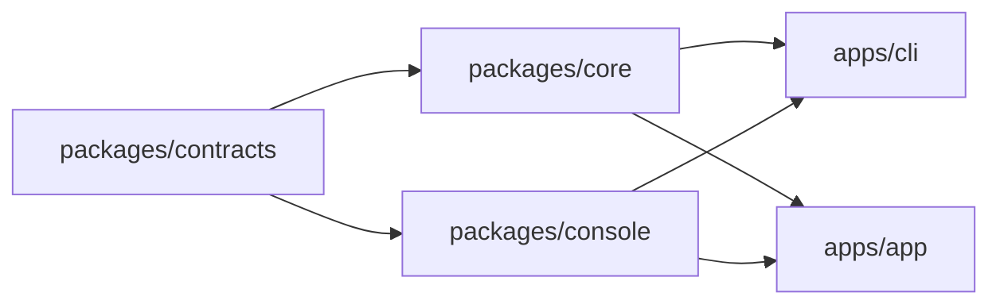

# 包结构与多形态分发

> **本文是该主题的唯一权威**：包边界、目录归属、宿主适配点、运行时配置来源、CLI 契约与阶段划分。
> 其它文档提到同一主题时只写结论加链接，不复述细节。构建命令与打包产物清单以根 `package.json` 的 scripts、各包 `scripts/`（跨包工具在 `packages/toolkit/scripts/`）与各包 `package.json` 为准。

## 1. 目标

同一套核心能力，拆成可独立消费的包，支持两种交付形态（外加作为库直接使用）：

1. **CLI**：`osw start` 启动核心服务，同时托管 Web 控制台；用户用浏览器操作，也可以只用 HTTP API。
2. **App**：Electron 只做宿主封装（窗口、托盘、自动更新、系统密钥环），业务能力全部来自核心包。

核心原则：**core 不知道宿主是谁**。宿主差异（密钥存储、Web 托管、桌面能力、语言环境）全部收敛为接口注入，core 内不出现 `electron`、不出现静态文件路径假设。

## 2. 交付形态

| 形态 | 组成 | 入口 | 分发方式 |
| --- | --- | --- | --- |
| 库 | `core` + `contracts` | `import { startServer } from '@osw/core'` | npm |
| CLI | `core` + `contracts` + `console` 静态产物 + Node 密钥实现 + 静态托管 | `osw start` | npm 全局 bin / `npx` |
| App | `core` + `contracts` + `console` + Electron 壳 | 桌面图标 / 安装包 | electron-builder |

三个形态共用同一份管理 API 契约（见 [tech-architecture.md](./tech-architecture.md)「管理 API 契约」），控制台不做形态分支。

## 3. 包边界



工作区分两层，划分依据是「能不能被第三方单独消费」，不是「能不能直接执行」：

- `packages/`：可被外部依赖的库。`contracts`、`core` 是纯逻辑包，第三方可以只装这两个当库用；`console` 的静态产物也可被任意宿主托管。
- `apps/`：宿主壳。`cli` 与 `app` 只做进程生命周期、参数解析与平台能力适配，不被任何包依赖，也不作为库发布。

| 位置 | 包 | 职责 | 硬约束 |
| --- | --- | --- | --- |
| `packages/contracts` | `@osw/contracts` | Zod schema、协议表、错误码、i18n 语言目录与核心、`SecretStore` 接口、运行时配置类型、供应商包格式、路由契约类型 | 只描述形状；不依赖 Node 内置模块、不依赖 DOM、不依赖任何其它包 |
| `packages/core` | `@osw/core` | runtime / management / proxy / database / infrastructure / security | 纯 Node；**禁止 import `electron`**；不感知 Web 托管与桌面能力 |
| `packages/console` | `@osw/console` | React 控制台，构建为静态产物 | 不直接读 `window.electronAPI`；宿主能力统一走平台抽象层 |
| `apps/cli` | `@osw/cli` | 命令行入口、Node 密钥实现、静态托管 | 只做宿主适配与参数解析，不写业务逻辑 |
| `apps/app` | `@osw/app` | Electron 主进程与 preload | 只做宿主适配，不写业务逻辑 |

依赖方向严格单向：`core` 与 `console` **互不依赖**，二者之间只通过管理 API 通信。

> 约束由静态检查强制（`packages/toolkit/scripts/check-package-boundaries.mjs`，接入 `pnpm lint`），与 `proxy/` 分层检查同一思路：写进文档的规则只有共识价值，能失败的检查才有约束价值。

## 4. 目录结构

### 4.1 目标态

```text
osw/
├── packages/
│   ├── contracts/
│   │   ├── package.json
│   │   ├── tsconfig.json
│   │   └── source/
│   │       ├── index.ts
│   │       ├── schemas.ts
│   │       ├── protocols.ts
│   │       ├── errors.ts
│   │       ├── secret-store.ts        # SecretStore 接口 + key reference 生成
│   │       ├── runtime-config.ts      # RuntimeConfig 类型与默认值合并
│   │       ├── database-file.ts
│   │       ├── proxy-origin.ts
│   │       ├── provider-bundle.ts
│   │       ├── utils.ts
│   │       ├── i18n/                  # 语言目录、核心、类型
│   │       └── router/                # 路由契约类型与预设
│   │
│   ├── core/
│   │   ├── package.json
│   │   ├── drizzle/                   # 两条迁移链：config/ 与 data/（随包分发）
│   │   └── source/
│   │       ├── index.ts               # 生命周期入口 startServer / stopServer
│   │       ├── runtime/
│   │       ├── management/
│   │       ├── proxy/
│   │       ├── database/
│   │       ├── infrastructure/
│   │       └── security/
│   │
│   ├── console/
│   │   ├── package.json
│   │   ├── index.html
│   │   └── source/
│   │       ├── main.tsx / App.tsx / routes.tsx
│   │       ├── platform/              # 宿主能力抽象（新增）
│   │       ├── api/ features/ pages/ components/ hooks/ store/ services/ i18n/
│   │       └── lib/ infrastructure/
│   │
│   └── toolkit/                       # 跨包开发脚本：lint / test / typecheck / 包边界守卫 / 脚本运行库
│       └── scripts/
│
├── apps/
│   ├── cli/
│   │   ├── package.json               # bin: osw
│   │   └── source/
│   │       ├── index.ts               # argv 解析与分发
│   │       ├── commands/              # start / stop / status / config / version
│   │       ├── secret-store.ts        # EncryptedFileSecretStore
│   │       ├── static-server.ts       # 控制台静态托管
│   │       └── native-i18n.ts         # CLI 的终端语言层
│   │
│   └── app/
│       ├── package.json
│       ├── electron-builder.config.cjs
│       ├── build/                     # 应用图标与托盘图标
│       └── source/
│           ├── main/                  # index / tray-* / updater / auto-launch / secret-store / i18n
│           └── preload/
│
├── docs/                              # 文档：上游协议参考 + 产品规格
│   ├── references/                    # 三家上游 API 的逐字快照
│   └── product/                       # 产品规格文档
├── turbo.json                         # 任务编排与依赖顺序
└── pnpm-workspace.yaml
```

### 4.2 导入别名

源码目录一律叫 `source/`（不用 `src/`）：全仓库同名后，glob、别名配置与守卫脚本都只有一种写法，也不用为每个包单独记一条例外。

`apps/app/source` 目前保持平铺一层（`index.ts` / `preload.ts` / `tray-*.ts` / `updater.ts` …），不拆 `main/` 与 `preload/`：拆目录会同时改变 Vite 入口、`__dirname` 推导与 preload 相对路径，属于独立变更，不与目录搬迁混做（留到 S3，见 §7）。

**别名沿用旧名，只重指目标**：`@common/*` → `packages/contracts/source`，`@server/*` → `packages/core/source`，`@/*` → `packages/console/source`，`@render/*` → `packages/console`。别名定义分散在三处（`packages/console/vite.config.ts`、`apps/app/vite.shared.ts`、`packages/toolkit/vitest.config.ts`），改路径必须三处同步，否则会出现「测试能过、构建能过、跑起来才炸」的分裂状态。

理由：包内引用约 866 处、跨包引用约 316 处，一次性重写所有 specifier 既无法用类型检查分批验证，也无法在 `moduleResolution: bundler` + 纯源码（无构建产物）的工作区里靠包的 `exports` 字段解析。别名间接层是等价的替代，而且它本身就是后续「按包独立构建」的接缝。真正的 specifier 迁移放到各包开始产出构建产物时再做，届时是机械替换，可验证。

> 现状补充：`contracts` 与 `core` 目前仍以 `exports: "./source/*.ts"` 直接暴露源码，不发构建产物；也就是说别名与 `exports` 两套解析路径目前并存。等 S1 让 core 产出 ESM 产物时，二者应当只留一套。

### 4.3 根级资产的最终归属

根目录只保留工作区级配置（`pnpm-workspace.yaml`、`turbo.json`、`tsconfig.json` / `tsconfig.base.json`、`eslint.config.js`、`package.json`）与 `docs/`、`release/`。**留在这里的都不是残留**：`pnpm-workspace.yaml` 决定 workspace 成员，`turbo.json` 由 turbo 在根查找，`tsconfig.json` 是各包 `extends` 的目标，`eslint.config.js` 由 `eslint .` 从 cwd 向上找——把这些搬走才是破坏约定。同样只被脚本读取的 `vitest.config.ts` 与 `tsconfig.check.json` 归 `packages/toolkit`（见 §5.8）。

其余资产（包括脚本）按「谁用谁持有」归属各自的包：

| 资产 | 现在的位置 | 引用方式 |
| --- | --- | --- |
| 应用图标与托盘图标 | `apps/app/build/` | 源码里用 `?url` 内联（`assetsInlineLimit: Infinity` 让图标变成 data URL，避免 asar 内多一次文件寻址）；electron-builder 的 `icon` 相对 `apps/app` 解析 |
| 打包配置 | `apps/app/electron-builder.config.cjs` | `apps/app/scripts/build.mjs` 显式 `--config`；`directories.output` 指回仓库根 `release/`，`afterPack` 为同包内 `scripts/macos-adhoc-sign.cjs` |
| Electron 与 electron-builder | `apps/app/package.json` 的 devDependencies | 宿主包自己声明。electron-builder 只在 `<projectDir>/node_modules` 里找 Electron（见坑 4），把依赖留在仓库根等于「开发全通、只在打包时失败」 |
| 控制台静态资源 | `packages/console/public/` | Vite 的 `publicDir`，随渲染层构建拷贝进 `packages/console/output` |
| 各包脚本 | `apps/app/scripts/`、`packages/core/scripts/`、`packages/console/scripts/` | 根 `package.json` 的 scripts 指向包内路径（`apps/app/scripts/{build,dev,version}.mjs`、`packages/core/scripts/{db,check-proxy-layers}.mjs`、`packages/console/scripts/{eslint-plugin-i18n.mjs,vitest.setup.ts}`） |
| 跨包脚本 | `packages/toolkit/scripts/` | 私有工作区包（`@osw/toolkit`，无运行时代码）：任务编排（lint / test / typecheck）、版本写入与校验、包边界守卫与脚本运行库。它们不属于任何单一业务包，所以独立成包而不是堆在根目录。同样只被这些脚本读取的 `vitest.config.ts` 与 `tsconfig.check.json` 也住在这里 |
| 打包产物 | `release/<version>/` | 仍在仓库根：它是构建**输出**，不属于任何包的源码 |

挪动这些资产时必须同步核对的四处：

1. **图标同时被源码级相对路径引用**。`?url` 的解析基准是源码文件而不是配置文件，所以改目录必须连带改源码里的引用，只看配置文件会漏。
2. **`__dirname` 推导需要重新核对**。产物布局是「主进程、preload 与服务进程都住 `apps/app/output/command/`，渲染层与迁移基线由 electron-builder 抬进 asar 的 `output/render` 与 `packages/core/drizzle`」——这几条映射是一组，动一条必须重新验算其他条。`apps/app/electron-builder.config.cjs` 与 `apps/app/vite.shared.ts`（以及 `vite.server.config.ts` 的 `entryFileNames` / `chunkFileNames`）里各有一段注释专门记录这层约束。

   这里有一个踩过的坑（当前配置已绕开，保留备查）：**`asarUnpack` 在 `files` 含跨包 `{ from, to }` 映射时根本用不了**。它的过滤根被钉死在 `projectDir`（即 `apps/app`），而只要它不是空数组，打包时就会拿这个过滤器去扫**整个**文件集——扫到源在仓库别处的条目（`packages/console/output`、`packages/core/drizzle`）时直接抛 `... must be under .../apps/app`。当时换 `extraResources` 绕开了这层：它一个文件一个 `to`，可以直接指向 `app.asar.unpacked/...`，且不参与 `files` 过滤。但服务进程改成 `utilityProcess` 后，服务代码同主进程一样能直接从 asar 里加载（见 §5.7），所以 `asarUnpack` 与 `extraResources` 都已从配置里删干净，`files` 里只剩 `output` 与紧跟在后的两条排除。
3. **脚本的「仓库根」是数目录数出来的**。脚本用 `import.meta.url` 往上数目录定位仓库根，换目录必须同步改层数，否则它会在错误的 cwd 里跑（症状是「找不到 tsconfig」而不是「找不到脚本」）。同理，跨包引用运行库用相对路径时，层数也跟着目录深度变。
4. **electron-builder 只在自己的包里找 Electron**。它探测版本靠读 `<projectDir>/node_modules/electron/package.json`，**不会逐级向上找**，而打包时的 `projectDir` 就是 `apps/app`——所以 Electron 必须由 `apps/app/package.json` 声明。同理 `author` 与产物入口 `main` 也得在被打包的那份清单里，根清单不参与。根 `package.json` 保留 `electron` 只剩一个理由：仓库级测试要跑在 Electron 的 Node 里（`node:sqlite` 的 ABI 必须与 app 对齐），那是测试基建的事，不是宿主的事。

## 5. 宿主适配点

以下八项是 `core` 与宿主之间全部的耦合面。除这些之外，`core` 不得感知宿主存在。

### 5.1 密钥存储

接口在 `packages/contracts/source/secret-store.ts`（`SecretStore` + `generateKeyReference`），`core` 只依赖它，两个宿主各自实现：

| 宿主 | 实现 | 说明 |
| --- | --- | --- |
| App | `ElectronSecretStore` | 沿用 `safeStorage.encryptString` / `decryptString`，密文写在数据目录下的 `secrets.json` |
| CLI | `EncryptedFileSecretStore` | 随机 32 字节主密钥存 `secrets.cli.key`（`0600`），逐条 AES-256-GCM 加密写入 `secrets.cli.json` |

CLI 侧的取舍要写清楚：这是**文件级加密**，防止的是备份、误传、被其它用户读到；它不防「同用户同机器上的恶意进程」——那需要系统钥匙串，会引入原生依赖，与「零原生依赖」的约束冲突。接口化之后，未来接入钥匙串只是一个新实现，不改 core。CLI 的实现放在 `apps/cli/source/secret-store.ts`。

**两个形态的文件名故意不同**（`secrets.cli.json` / `secrets.cli.key` vs `secrets.json`），虽然它们落在同一个数据目录里。密文算法不同，同名同址的结果不是「共用密钥」，而是**后写的那个把前一个的条目全部作废**：`safeStorage` 的 base64 密文在命令行侧解不开，命令行的 `v1:iv:tag:ciphertext` 在 `safeStorage` 侧会被当成非法 base64 直接抛错。供应商 key 在服务端只存哈希、作废了不可再生，所以这里必须靠文件名隔开。

代价写在明处：同一个数据目录里两个形态的密钥各存各的，用命令行 Web 控制台配过的 key 在桌面端不会自动出现（反之亦然）。共用的是数据库、设置与日志——供应商条目本身带着 `keyReference`，所以另一边看到的是「这个供应商没配密钥」，而不是静默拿空密钥发请求。要让密钥也真正共用，只能让一边放弃自己的密码学实现（命令行引入原生依赖，或桌面形态把主密钥落到密文旁边），那是安全取舍，本版本不做。

设计要点：

- 主密钥文件缺失时自动生成；存在但不可读时**报错而非静默重建**（静默重建等于把用户已有的密钥全部作废）。
- 支持 `OSW_SECRET_KEY`（base64 的 32 字节）覆盖主密钥，服务于容器与 CI；环境变量存在时**不**读写 `secrets.key`，避免两处主密钥共存后互相解不开。
- 密文格式自带版本前缀（`v1:iv:tag:ciphertext`）：以后换算法或换格式时旧数据仍可识别，而不是把新写法当成损坏数据抛异常。

### 5.2 Web 托管

管理服务在 `/api` 之外还能托管控制台静态产物，由宿主在 `RuntimeConfig.webRoot` 里传入根目录决定是否启用；App 仍用 `loadFile` 以 `file://` 加载、传 `null`。

托管实现落在 `packages/core/source/management/core/static-web.ts`，两个宿主共享同一份行为。落定下来的细节都只在真实 HTTP 交互下才看得出来，因此都有对应单测（真起 `http.createServer` 并 `listen(0)`，不用假的 `ServerResponse`——它用的是 `createReadStream().pipe(res)`，假对象盖不住流式写入）：

- 入口页不缓存（否则每次升级用户看到的还是旧 HTML），哈希资产一年 immutable。
- SPA fallback 只在「未命中静态文件且不是 `/api/*`」时生效；带扩展名却没命中的路径**不**回退 HTML，否则一个写错的资源路径会返回 `200` + 一段 HTML，浏览器报的错会指向语法而不是「文件不存在」。
- 路径必须限制在根目录内，且同时拦住字面 `../` 与编码后的 `%2e%2e`（两道都要，只做字符串前缀比对会被编码绕过）。
- 只处理 `GET` / `HEAD`，其余方法不接管而是落回原有路由。

- CLI：`--web`（默认开启）时托管控制台产物，`/` 走 SPA fallback（未命中静态文件且不是 `/api/*` 时返回 `index.html`）。
- App：保持 `loadFile`，不启用静态托管（避免多开一个可被局域网访问的入口）。
- 静态根目录由宿主传入（App 用 asar 内路径，CLI 用包内 `output/web`），core 不硬编码路径。

守卫必须保持：静态托管只挂在管理服务上，默认只监听 `127.0.0.1`。**不做 Host 头白名单校验**：网络可达性交给 `listenHost` 与操作系统防火墙（见 [security-privacy.md](./security-privacy.md)）。这里刻意不叠加第二套应用层白名单——一旦叠上，就只能监听 `localhost` 系名字，「能访问」与「不能访问」的理由就从一处变成两处，而 CLI 形态下用户完全可以自行改 `--host`。

### 5.3 前端运行时注入

`packages/console/source/api/client.ts` 在运行时解析 API base，优先级从高到低：

1. `window.__OSW__?.apiBase` —— 宿主注入（目前只有 Electron preload 会注入绝对地址；CLI 托管时不注入，走第 2 条）。
2. `location.protocol` 为 `http:` / `https:` 时用 `${location.origin}/api` —— CLI 同源场景，无需注入也能工作。
3. 回退到内置默认端口 —— 保证 `dev:preview` 与单测不炸。

这一项是 CLI 能跑起来的前提：`file://` 下 `location.origin` 为 `null`，必须靠注入；而 CLI 同源场景则天然可用。

### 5.4 桌面能力抽象

`packages/console/source/platform/capabilities.ts` 把宿主能力收敛为一个对象，`update-card.tsx` 不再出现 `window.electronAPI` 字面量：

```ts
interface PlatformCapabilities {
  name: 'electron' | 'web'
  updater: UpdaterApi | null      // web 下为 null，UI 显示「当前形态不支持」
  openExternal: (url: string) => void
  autoLaunch: AutoLaunchApi | null
}
```

判定顺序：`window.electronAPI` 存在 → `electron`；否则 → `web`。控制台只消费 `PlatformCapabilities`，不再出现 `window.electronAPI` 字面量。

「不支持」必须是**正常状态**而不是错误：沿用既有做法（同一套布局 + `—` 占位 / 明确的不可用提示），不切换成简化排版。

### 5.5 运行时配置

`packages/contracts/source/runtime-config.ts` 提供 `RuntimeConfig` 与 `createRuntimeConfig`，`runtime-profile.ts` 的两档预设降为默认值来源。

```ts
interface RuntimeConfig {
  environment: 'development' | 'production'
  dataDir: string
  proxyHost: string
  proxyPort: number
  managementHost: string
  managementPort: number
  serveWeb: boolean
  webRoot: string | null
}
```

- 宿主只往 `core` 交一个完整的 `RuntimeConfig`：`startServer({ runtimeConfig, secretStore, systemProxyResolver?, shutdown? })`。`core` 不读环境变量、不猜默认值、不算地址，返回的是 `ServerEndpoints`（实际生效的地址与端口）。
- 宿主负责构造：App 用 `app.setPath('userData', path.join(os.homedir(), runtimeProfile.dataDirectoryName))`（必须在 `app.whenReady()` 之前设，之后 `app.getPath('userData')` 与 `os.homedir()` 才是同一个答案），`shutdown` 传 `null`（它有自己的退出路径）；CLI 用参数 + `defaultDataDirectory()`，并传入一个退出握手对象（见 §6 的 `stop`）。
- **两边都不算数据库文件名**：两个库各自带 schema 版本常量，文件名由 `@common/database-file` 从版本号推导。宿主少算一次文件名，就少一个两种形态可能算出不同结果的地方。
- CLI 参数覆盖：`--data-dir`、`--proxy-port`、`--management-port`、`--host`、`--web` / `--no-web`。端口与数据目录名的缺省值来自 `getRuntimeProfile(CLI_RUNTIME_ENVIRONMENT)`，不另存一份写死的副本。
- `--host` **只作用于代理**，没有对应的 `--management-host`：管理服务不带鉴权，固定监听回环，要远程访问就走 SSH 隧道（`--help` 末尾会直接写明这一点，免得有人翻遍选项去找那个旗标）。所以两个 `*Host` 字段不能合并成一个。
- `--host` 与 `proxyHost` 的关系要注意：`RuntimeConfig.proxyHost` 只是**默认值**，真正生效的监听地址是设置里的 `listenHost`（用户在界面上改过就以设置为准）。因此「命令行传了 `--host` 却没生效」在已有数据目录上是正常行为，而不是配置没被读到。

数据目录的规则只有一条：**`<用户主目录>/<预设数据目录名>`**，两种形态共用这一条，三个平台也是同一条——不再有「先按平台算 appData 目录、再拼目录名」这一步。App 侧是 `app.setPath('userData', path.join(os.homedir(), profile.dataDirectoryName))`；CLI 侧是 `apps/cli/source/host.ts` 里的 `defaultDataDirectory()`（纯函数，`path.dirname()` 的结果就是 `os.homedir()`，能单测）：

| 形态 | 数据目录 |
| --- | --- |
| 正式 | `~/.osw` |
| 开发（`pnpm dev`） | `~/.osw-development` |

选主目录而不是平台 appData 目录，两个原因。一是 Windows 的 `%APPDATA%` 是**漫游配置目录**：会持续增长的请求日志与正文进去后，在有域控的机器上会被同步到服务器，这是实打实的缺陷。二是主目录把平台差异从结构上抹掉了：只要还按平台算目录，两个宿主就必须各写一份实现，任何一侧写错都会让同一个用户拿到半个数据目录（数据库、设置、日志、历史统计全部对不上），而两边都「看起来正常」。

三个平台都不新增环境变量：用户改位置只能靠 `--data-dir`。

目录名只允许来自 `getRuntimeProfile(environment).dataDirectoryName`，不许在宿主里写字面量，也不许自己判断平台。CLI 恒定跑 `production` 档（`CLI_RUNTIME_ENVIRONMENT`，`host.ts` 里**唯一**一处选择）：命令行没有「开发服务器」这个输入，所以 `OSW Development` 只属于 `pnpm dev` 下的桌面形态。

宿主把这三个默认值收在 `apps/cli/source/host.ts`，不散落在命令里：`--help` 里显示的默认数据目录与真正启动时用的是同一个函数，免得帮助里写一套、实际跑另一套。

留一个已知的重复：回环地址 `'127.0.0.1'` 目前在 `runtime-config.ts`（两个 `*Host` 的兜底）、`help.ts`（`--host` 的显示默认值）与 `schemas.ts`（`listenHost` 的 schema 默认值）各有一份字面量。三处现在同值，没有实际危害，但改默认监听地址时必须一起改——这正是 §5.8 反复出现的那类「同一个事实存在多份」，只是它这次落在常量而不是路径上。

### 5.6 i18n 三层

现状：语言目录与核心在 `packages/contracts/source/i18n`，UI 层在 `packages/console/source/i18n`，宿主 native 层在 `apps/app/source/i18n.ts`。

目标：分层不变，归属调整。

| 层 | 归属 | 形态差异 |
| --- | --- | --- |
| 语言目录 + 核心 | `contracts` | 三种形态共用 |
| UI | `console` | 三种形态共用 |
| native | 各宿主自己 | App：托盘、菜单、原生对话框；CLI：终端输出 |

CLI 的 native 层需要一套独立文案（启动横幅、端口占用、数据目录、退出提示），放进 `apps/cli/source/native-i18n.ts`。诊断消息仍按既定契约固定英文（见 [i18n.md](./i18n.md)）。

### 5.7 数据库迁移资源定位

`getMigrationsFolder(role)` 从**模块目录**逐级上溯（最多 8 层）寻找 `packages/core/drizzle`，命中即返回 `packages/core/drizzle/<role>`；全链未命中才退到 `process.cwd()/packages/core/drizzle/<role>`，仍落空则返回 `moduleDirectory/packages/core/drizzle/<role>`，让上层报错直接指向一个可解释的期望位置。

**两个库共用这一个上溯过程**是有意的：上溯查找、asar 映射、CLI 的 `files` 只认「`packages/core/drizzle` 这个目录」，拆库只改变了它下面有几个子目录（`config/`、`data/`），没有改变任何一条路径假设。反过来说，给两个角色各写一套上溯逻辑才是真正的风险：两条链会以不同的方式失配，而失配只在运行期才报。

为什么不用固定层数：`drizzle/` 到模块目录的相对深度在两种形态下不同——

| 形态 | 模块目录 | 到 `packages/core/drizzle` 的上溯层数 |
| --- | --- | --- |
| 开发（`pnpm dev`） | `apps/app/output/command/` | 4 层到仓库根 |
| 打包（asar 内，主进程与服务进程） | `app.asar/output/command/` | 2 层到 asar 根（electron-builder 把 `packages/core/drizzle` 映射进去） |

打包形态只有上面**一种**：服务进程是 Electron 的 `utilityProcess`，走的是和主进程同一套模块加载路径（`fs` 上的 asar 补丁对它同样生效），于是 `service-main.mjs` 与其 chunk 直接住在 `app.asar/output/command/`，两者上溯层数天然一致，不需要任何刻意对齐。

这也是从 `worker_threads` 搬家的根本原因：`worker_threads` 读不了 asar（Electron 只给主进程的 `fs` 装了 asar 解析，worker 线程没有这层补丁），所以才曾经不得不把服务代码与一份迁移基线摊到 `app.asar.unpacked/` 下，既多一层路径假设，又让产物分成两截。

`files` 里那两条排除模式（`!output/**/*.map`、`!node_modules`）**必须紧跟在 `output` 后面**：electron-builder 把连续的字符串项归一化成同一个 file set 的 `filter`，而每个 `{ from, to }` 项各自独立成一个 set；一旦排除项被 `{ from, to }` 隔开，它就退化成「只含排除项」的 set，而 `minimatchAll` 是逐个模式累进判定的，没有前置正向模式时排除项会静默失效。`!node_modules` 排除的是 `@osw/*` 那几包：它们以 `exports: "./source/*.ts"` 形态被 electron-builder 整包拷进 asar，里面只有 TS 源码与 `*.test.ts`，而 Vite 已经把要用的代码全部 bundle 进 `output/`（实测打包产物里 `@osw/` 的出现次数为 0），白白占掉约 3 MB / 29% 的 asar 体积。

固定层数必然在某一侧失效，且失效是运行期才报的。上溯查找对两端同时成立，产物布局再变也不会静默失配。

要求：

- `drizzle/` 必须随包分发（App 的 `files`、CLI 的 `files` 都要包含）。CLI 当前**不发布**、没有 `files` 字段，上溯查找在仓库内从 `apps/cli/output/` 向上到仓库根命中 `packages/core/drizzle`；一旦开始打包分发，这条就从「恰好成立」变成「必须显式声明」。
- 不依赖 `process.cwd()`：CLI 可以在任意目录启动，cwd 探测只是开发期便利，不是唯一来源；打包后必须靠模块相对路径命中。
- **不要把这一类路径经 `process.env` 传入**：宿主构建会用 Vite，而 Vite 默认把 `process.env` 静态替换为 `{}`，传入的值读出来永远是 `undefined`（详见 §5.8）。

### 5.8 构建与测试编排

现状（已全部落地）：

| 包 | 产物 | 工具 |
| --- | --- | --- |
| `contracts` | 不产出构建物，`exports` 直接指向 `./source/*.ts` | — |
| `core` | 同上 | — |
| `console` | 静态文件 `packages/console/output` | `vite build`（`packages/console/vite.config.ts`） |
| `app` | `apps/app/output/command/{index.js,preload.js,service-main.mjs}`（三份产物连同 chunk 全在 asar 内），再交给 electron-builder | 三份 Vite 配置 + `apps/app/scripts/build.mjs` |
| `cli` | ESM `output/index.js`（`bin` 指向它）+ `output/web`（拷入的控制台产物） | `vite build`（`apps/cli/vite.config.ts`）+ `apps/cli/scripts/build.mjs` |

编排由 Turborepo 承担（`turbo.json`）：

- `build` 依赖 `^build`，顺序只由依赖图决定：`contracts` → `core` → `console` / `app` / `cli`。实测 `pnpm build` 只跑 3 个任务（只有 console、app 与 cli 真的有构建步骤），「谁先构建」不再需要人工记忆。`cli` 把 `console` 列为 `devDependencies` 纯粹为了让它进依赖图：它构建时需要 `packages/console/output` 存在（拷入自己的 `output/web`），而自己不 import 控制台一行代码。
- `typecheck` / `test` 同样依赖 `^build`：上游没通过时，下游的报错不参与排查。
- `lint` 无依赖、可并行，因为它不写产物。
- `dev` 标记为 `cache: false` + `persistent: true`：turbo 并行拉起而不等待依赖，跨进程顺序由宿主自己的编排脚本负责（`apps/app/scripts/dev.mjs`）。
- turbo 要求根 `package.json` 声明 `packageManager`，缺失会直接拒绝运行。

版本号的注入点在拆分后每个宿主一处：`console` 在 `packages/console/vite.config.ts`（`__APP_VERSION__`）、`cli` 在 `apps/cli/vite.config.ts`（`__CLI_VERSION__`），两者都取**仓库根** `package.json` 的版本；`packages/toolkit/vitest.config.ts` 必须把两份 `define` 都同步（两处不同步会让任何间接 import 的测试炸掉）。`packages/toolkit/scripts/version.mjs` 是唯一的版本入口，而版本号只写在仓库根的 manifest 里：`pnpm version:set <version>` 从 `pnpm-workspace.yaml` 现算 workspace 包目录、把根版本**强制覆盖**到每一份 manifest（加包不必改脚本），`pnpm version:check` 只读校验它们全都与根一致，挂在 `pnpm lint` 里。之所以要专门盯它，是因为链路上有一份**不是代码**的清单：`release.yml` 的 `Commit version` 步骤得把改过的 manifest `git add` 进去，漏一个就会出现「产物对、仓库错」——两边的文件不一致，而 `pnpm typecheck` / `lint` / `test` 一路全绿也看不出来，只有在发布之后回头读一遍仓库才会撞见。那里的 glob 必须与 `version.mjs` 现算的包目录保持同一对；`--check` 则负责让「漏提交」在 CI 上直接变红。

测试保持单一 workspace 配置（`packages/toolkit/vitest.config.ts` + `packages/console/scripts/vitest.setup.ts`，经 `packages/toolkit/scripts/test.mjs` 以 Electron 的 Node 执行，以匹配 `node:sqlite` 的 ABI），可按包过滤。两个静态守卫都必须保持通过：`packages/core/scripts/check-proxy-layers.mjs`（指向 `packages/core/source/proxy`）与 `packages/toolkit/scripts/check-package-boundaries.mjs`（已只登记 `packages/*` / `apps/*` 布局）。

宿主构建由 `apps/app/vite.shared.ts` 与 `apps/cli/vite.config.ts` 自己负责，没有插件代为处理 Node 与浏览器的构建差异。下面四件事**缺了都只在运行期暴露、且构建全过程无警告**（症状分别是「入口函数不是函数」、「require 不可用」、「开发态静默按生产端口启动」和「动态导入直接 `ReferenceError`」）：

| 配置 | 缺失时的症状 |
| --- | --- |
| `rolldownOptions.external` 列出 `builtinModules` 加一条 `/^node:/` 正则 | `node:fs` / `node:url` 等被换成浏览器空模块，启动即 `(0, v.fileURLToPath) is not a function`。两个细节：`builtinModules` 里只有不带前缀的名字（Node 22 的 `sqlite`，而不是 `node:sqlite`），所以 `node:` 前缀的写法必须靠那条正则覆盖；而 `platform: 'node'` **不负责**外部化，它只管解析条件与 CJS 互操作（`apps/app/vite.shared.ts` 里那张表就是围绕这一条写的） |
| `rolldownOptions.platform: 'node'` | 依赖里的 `require('fs')` 不再接上 `createRequire`，运行期报「environment that doesn't expose the require function」 |
| 顶层 `define: { 'process.env': 'globalThis.process.env' }` | Vite 把 `process.env` 整体替换为 `{}`，`process.env.VITE_DEV_SERVER_URL` 恒为 `undefined`，开发态静默按生产端口启动并加载本地 `index.html` |
| `build.modulePreload: false` | Vite 把动态 `import()` 包成 `__vitePreload(() => import(...), deps)`，其辅助函数在 `deps` 非空时读 `document.getElementsByTagName('link')`；Node 里没有 `document`，一旦有带依赖清单的动态导入就直接抛 `ReferenceError: document is not defined` |

`define` 是 Vite 的顶层选项，放进 `build` 里会被静默忽略——写成“配置看着对、行为不对”是这一步最容易踩的坑。

第四条（`modulePreload`）只跟动态 `import()` 有关，而 CLI 必须用它（先探测 `node:sqlite` 再加载 `core`，才能把“Node 太旧”说成人话，见 §6）；宿主主进程目前没有动态导入，所以这一行在 `app` 侧是**纯防御**。关掉它并不会把动态导入还原成原生写法——产物里仍然是 `helper(() => import(...), [])`，只是依赖清单为空时辅助函数走 `Promise.resolve()` 短路分支，不再碰 `document`。

两类「静态检查看不见、只有跑起来才发现」的脆点，新代码要避开：

1. **测试内不要硬编码目录路径**。以固定层数 `import.meta.url` 向上推导资源位置（如 `drizzle/`），或在测试里写死扫描根，目录一动就失效，而 typecheck 与 lint 都报不出来。一律改成显式路径列表或从配置读入——比如迁移链测试用 `describe.each(['config', 'data'])` 显式遍历两个库，而不是把层数推导再写一遍。
2. **`index.html` / manifest 里的相对资源路径要跟源码一起核对**。`packages/console/index.html` 的 `<script type="module" src="/source/main.tsx">` 指向错路径时，`pnpm typecheck` / `lint` / `test` 全绿，只有 `pnpm vite build` 失败（`Failed to resolve /source/main.tsx`）。它们不是「内容文件」，改目录时必须一并核对。

CI（`.github/workflows/ci.yml`）与发布（`release.yml`）共用 `.github/actions/setup/action.yml`，两处缓存都由它按 job 开关，因为缓存的适用面本来就不是「全仓库」而是「某个任务到底有没有写这个目录」：

| 缓存 | 路径 | 开关 | 实际在用的 job |
| --- | --- | --- | --- |
| Turbo 任务缓存 | `.turbo` | `turbo-cache`（默认开） | `release.yml` 的矩阵构建与 `ci.yml` 的 `Build application`：只有跑 `turbo run build` 的 job 会写（`pnpm build` / `pnpm release:*`），而 CI 的 typecheck / lint / test 由包内脚本直跑 |
| ESLint 缓存 / tsc 增量信息 | `node_modules/.cache` | `tool-cache`（默认关） | `Lint`（`eslint . --cache`）与 `Typecheck`（`tsc --incremental`） |

`ci.yml` **有** build job（`needs: [typecheck, test]`，跑 `pnpm build`，产物作为 `osw-build` 上传）。它曾经被删掉过，理由是「每 push 都打一遍只换来一份没人下载的 artifact」——但那是把两件事混成了一件：**CI 要回答的是「这次改动还能不能构建」**，而 `release.yml` 回答的是「发布产物对不对」。前者只有每次 push 都跑才有意义，后者只在发版时跑；产物路径、`entryFileNames`、`index.html` 里的模块引用这类错误，typecheck / lint / test 全绿也照样漏过去，只有真的跑一次 `pnpm build` 才看得见。上传的 `osw-build` 是打包的**输入**（`packages/console/output` + `apps/app/output` + `apps/cli/output`），不是可直接运行的安装包；要一个可下载、可运行的测试包走 `.github/workflows/test-build.yml`——手动触发，命令与 `release.yml` 完全相同，只是不创建 Release、不改版本号、不打标签。Worker 那边仍由 Cloudflare Workers Builds 里的 build 命令（与线上部署同参数）覆盖。

缓存一个命令根本不会创建的目录比不缓存更糟：`actions/cache` 在保存阶段报 `Path Validation Error`，job 白跑一趟，还占着日志让人以为缓存生效了——`typecheck` / `lint` / `test` 三个 job 的 `.turbo` 就属于这种情况，因此显式关掉。另一点是收益只出现在第二次运行（首次要写盘，约 15 s），所以 key 不能高频变化，否则等于每次都在付写入成本。本地冷热对照（同机、同一份工作树）：`tsc -p packages/toolkit/tsconfig.check.json` 16.7 s → 6.9 s；`eslint .` 6.1 s → 2.5 s（`pnpm lint` 整体只快一点，守卫脚本与 turbo/pnpm 启动占了大头）。electron-builder 的 Electron 二进制缓存（Windows 的 `%LOCALAPPDATA%\electron\Cache`、macOS 的 `~/Library/Caches/electron*`，每系统约 1.3 GB）**没有**纳入本次改动：Electron 压缩包从 CDN 下载是秒级的，而 Windows 87 s / macOS 91 s 的打包耗时主要在解压与封装本身，为它占掉一个可观份额的 10 GB 缓存配额不划算（未实测，只按量级判断）。

发布说明由 `apps/app/scripts/release-notes.mjs` 从提交记录生成，不手工维护（本地用 `pnpm release:notes` 预览；`release.yml` 的 publish job 不装依赖直接 `node` 跑它，因为它只 import `node:` 内建模块与 `electron-builder.config.cjs`）：

- 变更范围是「上一个发布标签..HEAD」。上一个标签优先取「走得到的标签里离 HEAD 最近的那个」——它表达的是「这一版从哪儿长出来」，历史被重写、补发旧线版本时都对；取不到时退回语义化版本比较，这里**不能**用 git 的 `versionsort`，它默认把 `-rc.1` 这类后缀排在同号正式版**之后**，`v1.0.0` 与 `v1.0.0-rc.8` 并存时会选反。两条都失效时按 `--since=<旧标签时间>` 划范围：旧标签落在已被重写的旧血统上时，`标签..HEAD` 会把两边不相干的三百多个提交也算进来。
- 分组与破坏性变更都从 Conventional Commit 的 subject / body 里读：`feat` → New，`fix` → Fixed，`perf` → Performance，`refactor` / `polish` / `style` → Changed，其余 → Under the hood；不符合约定的一律进 Other changes，宁可难看也不丢提交。`chore(release):` 不进列表，版本号提交不是变更。
- 下载表由**真实产物文件名**反推：按 `artifactName` 编译出带命名组的正则，平台与架构从匹配结果里取，大小取文件字节数。这样表里出现的文件一定真的在 release 里，不会出现「文档说有、实际没有」；`.zip` / `.blockmap` / `latest*.yml` 不列（内置更新器自己会取），`.sha256` 只在存在时给链接。
- 与之配套，校验文件的生成从「只算 macOS 的 dmg」改成遍历全部 `.dmg` / `.exe` / `.AppImage`：`Create installer checksums` 在三个系统的矩阵 job 内各算各的，所以下载表每一行都能给 SHA-256，不会只剩某一两行有链接、看起来像漏了。
- 范围端点默认 `HEAD`，可用 `--head <标签>` 换掉，补写一个**已经发出去**的版本时必须指到那个标签：否则标签之后合进来的提交会被算进那一版的说明（把没发布的活记在旧版本头上），并且这些提交会从下一版的说明里消失，让下一版看起来「什么都没改」。补写时同样没有本地产物目录，用 `--assets-json` 吃 `gh api repos/<owner>/<repo>/releases/tags/<标签> --jq '[.assets[] | {name, size}]'` 的清单：安装包几百 MB，只为拿文件名和大小再下一遍不值当。清单在 Windows 上按这个重定向写法存盘会带 UTF-8 BOM，脚本先剥掉再 parse，否则一个看不见的字节就会让 `JSON.parse` 把整份清单判为非法。`--assets-dir` / `--assets-json` 缺目录、缺文件都直接报错拦住发布，不静默省略下载表——发出去的说明少一块，比发不出去更糟。修改已发布版本的正文用 `gh release edit <标签> --notes-file <文件>`；说明文字仍然只在 GitHub 上改，不进仓库。
- 预发布版本（`parseVersion(tag)?.prerelease` 非空）的正文最前面固定压一段中英双语的提示：beta 每个版本都可能改接口与数据结构，不承诺数据兼容和自动迁移，更新前请手动导出供应商数据、更新后导入；原因链到 [issue #24](https://github.com/yinxulai/osw/issues/24)。这段必须在 Release Notes 的分组**之前**——用户得在点下载之前看见它，埋进分组就等于没写。正式版不带这段。
- `softprops/action-gh-release` 不再开 `generate_release_notes`：它自己附带的那行 Full Changelog 与脚本写的重复，两行怎么合并由 action 决定，不如自己只留一行。

## 6. CLI 契约

命令名 `osw`，无子命令时等价于 `start`。

| 命令 | 说明 |
| --- | --- |
| `osw start` | 启动代理与管理服务；`--web` 时同时托管控制台 |
| `osw stop` | 停止由本 CLI 启动的实例（通过数据目录下的运行时文件定位） |
| `osw status` | 输出运行状态、监听地址、数据目录、版本；只读，不清理失效的运行时文件；`--json` 输出同一份数据的机器可读形态 |
| `osw version` | 输出版本号（与 `--version` 同源） |
| `osw config` | 读取或写入设置（与设置页同一份数据）——**未实现**（见 §7） |

参数解析在 `apps/cli/source/options.ts`（纯函数，不碰进程与文件系统，便于单测）：无子命令时默认 `start`，`--opt=value` 与 `--opt value` 两种写法都接受，出现第二个位置参数即报错而不是默默丢掉。`--help` / `--version` 是全局开关，即使与子命令同时出现也优先输出后退出。`--json` 只对 `status` 有意义，出现在别的命令上直接按用法错误退出（退出码 `2`），而不是静默忽略——「参数被吞掉」比「参数被拒绝」难查得多。

行为约定：

- 前台运行，`Ctrl+C` 触发优雅退出（等价 `stopServer()`）；`--daemon` 不在首期范围内。`stop` 也走同一条关闭链路：向管理服务 `POST /api/runtime/shutdown`，然后**以「进程真的消失」为完成依据**，而不是相信 HTTP 响应——服务答应之后还可能死在关闭中途。
- 端口被占用时给出明确错误并以非零码退出，不静默换端口。
- 启动后打印访问地址、代理地址与数据目录，方便用户直接复制。`--no-web` 时打印同样的块，把「控制台」那一行换成「管理服务」地址、并补一行说明控制台托管已关闭——布局不因开关而变。
- CLI 依赖 `node:sqlite`，启动时做能力探测；不可用时给出明确的 Node 版本升级提示后退出，不做降级。这条能力探测必须是动态 `import()`：静态引入 `core` 会让旧 Node 在解析阶段就报「不认识的模块」，用户看到的会是一段与 CLI 无关的堆栈，而不是那句升级提示。
- 退出码语义固定为：`0` 成功（包括「本来就没在跑」）、`1` 运行期失败、`2` 用法错误。脚本据此能区分「命令写错了」与「跑起来但出错了」。
- **同一数据目录只有一个实例**。互斥是 core 的**基本能力**（`packages/core/source/runtime/instance-lock.ts`）：`startServer` 在绑定端口**之前**取锁，拿不到就抛 `InstanceLockError`，CLI 在 `start` 里把它翻译成人话并以退出码 `1` 退出，而不是覆盖 `runtime.json`——覆盖会让先启动的进程**失去身份**：`stop` 再也找不到它，它却还占着端口、开着同一个 SQLite 文件。
  - 端口冲突只能挡住「沿用默认端口」的那一半情况，`--proxy-port` 一换就绕过去了；`runtime.json` 也挡不住，因为它是**监听成功之后**才写的，两个进程在写它之前有一段谁都看不见的空窗。
  - 锁文件是数据目录下的 `instance.lock`，内容是一份 `{pid, startedAt, heartbeatAt}` 的声明；由 `startInstanceLockHeartbeat` 每 5 s 续写心跳。判定持有者是否还活着要**同时**看 pid 还在不在与心跳新不新鲜（心跳超过 6 个周期即视为旧），只判 pid 会把被操作系统复用的 pid 当成活实例。
  - 锁不长期持有文件句柄：Windows 上 `fs` 的默认共享模式允许别的进程删掉它，持有句柄并不构成强制锁。所以残留靠上面的存活判定识别，而且清算**只发生在取锁那一刻**——`acquireInstanceLock` 读到持有者已死（或读不出持有者、又过了宽限期）就地清掉重试。宿主不参与：`stop` 不碰锁文件，`start` 也不预清，谁都不会在别人正拿着锁时把它删掉。
  - 读到「锁文件存在但内容读不出」时不能立刻当残留删掉：创建与写入之间必然有一瞬是空文件，把这一瞬当成残留会让两个进程同时认为自己拿到了锁。按 mtime 给 5 s 宽限，超过它才是上次崩溃留下的半截文件。
- **崩溃也要留下干净的现场**。`uncaughtException` / `unhandledRejection` 统一走一次清理（删掉自己写的 `runtime.json`、打印一条 `[cli]` 前缀的说明）后以退出码 `1` 结束，并挂一个 5 s 的兜底定时器防止清理本身卡死；实例锁不归这里管——它由上面那套持有者判定接手，所以清理函数只删自己的文件，不会误伤别人的现场。少了这一段，崩溃一次就会留下「`status` 说在跑、`stop` 停不掉、`start` 又起不来」的三重假象。
- **`status --json` 与文本输出同源**。两者都由同一份 `InstanceReport` 渲染（`status-report.ts`），字段顺序固定为 `state` / `cliVersion` / `instanceVersion` / `dataDir` / `pid` / `startedAt` / `management` / `proxy` / `consoleUrl` / `staleRuntimeFile` / `portListening`，未知值一律 `null`，不出现给人看的占位符 `—`（脚本拿到 `"—"` 会当成字符串值用下去）。端点写成 `{host, port, url}`：`url` 是**连得过去**的地址，与 `host` 可能不同——`0.0.0.0` 是监听地址，不是可连接地址。
- **非回环监听时说清楚代价**。启动时若监听地址不是本机回环，往 stderr 打两行告警（代理端口不带鉴权，局域网内任何人可读写）；走 stderr 是为了不让它混进 `--json` 的 stdout，而且告警只提**代理**端口——管理接口虽然也没有凭证（见 [security-privacy.md](./security-privacy.md) 的「访问控制」），但它固定只监听回环、且只服务于自家控制台，拿一句模糊的「无鉴权」把它一起吓进来并不解决问题。
- 诊断信息（失效的运行时文件、端口未被监听、CLI 与实例版本不一致）一律走 stderr 且保持英文：它们面向的是日志与排查，不是终端里的用户，`--json` 的 stdout 必须可以原样喂给解析器。
- 冒烟验证由 `pnpm smoke:cli` 承担（`apps/cli/scripts/smoke.mjs`，9 步、对**构建产物**起真实子进程）：启动并校验横幅不泄露通配地址、管理 API 与 `GET /`、`status --json` 的运行中形态与文本 9 行布局、第二个实例被拒且第一个存活、`stop` 后端口释放与文件清理、伪造的死 pid 运行时文件被识别为「未运行」、`--no-web` 下 `GET /` 为 `404` 而 API 照常、以及各用法错误的退出码。静态检查全绿不等于 CLI 可用——它写文件、占端口、起子进程，这些只有真跑才会暴露。

### 与桌面形态的一致性

契约只有一句：**两种形态驱动的是同一套服务、同一份数据，差别只在「怎么把它起来」。** 凡是用户能看见的东西——数据库、设置、供应商与模型、重写规则、请求日志与保留策略、监听地址与端口的取值来源、`Ctrl+C` 走的优雅退出链路——都必须一致；允许不同的只有**宿主能力**本身。

| 维度 | 状态 | 说明 |
| --- | --- | --- |
| 数据目录 | 一致 | `<用户主目录>/<预设数据目录名>`，见 §5.5 |
| 数据文件名 | 一致 | 两边都由 `@common/database-file` 从**库自己的 schema 版本常量**推导（`config-v1.db` / `data-v1.db`）。宿主不算文件名，所以「两边算出不同文件名」这类差异从结构上不存在 |
| `RuntimeConfig` | 一致 | 同一份 `createRuntimeConfig`；命令行只多传端口与数据目录的覆盖值 |
| 代理引擎与业务 | 一致 | 同一份 `packages/core`，命令行不写业务逻辑（包边界守卫强制） |
| 设置与日志 | 一致 | 同一对 SQLite 文件（配置库 + 数据库），没有第二份配置 |
| 单实例 | 一致（同一个 core 能力） | 两边都由 core 的 `runtime/instance-lock.ts` 在绑定端口前取锁；区别只在于桌面形态还多一层操作系统级的 `app.requestSingleInstanceLock()`，第二次启动会唤醒已有窗口而不是报错 |
| 密钥存储 | 能力差异 | 桌面形态有系统钥匙串（`safeStorage`），命令行只能文件加密，文件名因此分开（§5.1） |
| 系统代理解析 | 能力差异 | 桌面形态用 `session.resolveProxy`（OS/Chromium）；命令行暂时不注入解析器，`system` 模式等价直连（见下） |
| 控制台托管 | 形态差异 | 桌面形态用窗口 `loadFile`；命令行没有窗口，只能由管理服务托管（`--web`，默认开） |
| 托盘 / 自动启动 / 更新器 / 原生对话框 | 形态差异 | 桌面上才有这些入口，命令行没有等价物 |

两处「能力差异」值得单独说明：

- **系统代理**：`system` 是默认的出站模式（见 [outbound-proxy.md](./outbound-proxy.md)），而命令行没有原生 API 能读操作系统的代理配置。当前不注入解析器，core 的默认返回值是 `DIRECT`，所以命令行下「跟随系统代理」等价于直连。这个结论是**看得见**的：`POST /api/diagnostics/outbound-proxy-test` 会返回 `system-direct`，不是静默失效。刻意不拿 `HTTP_PROXY` 之类的环境变量凑一个「像系统代理」的解析器——那会给命令行**新增**一种桌面形态没有的差异（Chromium 的 `session.resolveProxy` 不读环境变量），与本节要达成的目标相反。命令行下要用代理就选 `custom`。
- **`status` / `stop` 只认命令行启动的实例**：它们靠数据目录下的 `runtime.json` 定位实例，而桌面形态不写这个文件。桌面形态不写，是因为它的服务与窗口在同一个进程里，`stop` 停掉服务等于把用户的窗口弄成半死；写一个「能被发现却拒绝被停」的文件，只会把 `stop` 引向一次 10 秒超时。所以命令行启动的实例归命令行管，桌面形态的实例归它自己的窗口与托盘管。两者仍然共用同一个数据目录与同一对数据库文件，只是「谁在跑」这件事各有各的真相来源。

## 7. 阶段划分

进度与验收状态以 [roadmap.md](./roadmap.md) 的「工程演进」为准；本节只写阶段划分与**还没做完的部分**。

- 已完成：S0 骨架平移，以及 S2–S2.5（CLI 成型与 §5.1–§5.5 五项宿主适配、生产级细节、两种形态一致性、数据落用户主目录 + 两库拆分、宿主与实例身份收口、管理接口去鉴权）。这些阶段的结论就是本文件 §4–§6 的现状描述，逐阶段验收记录见 [roadmap.md](./roadmap.md)。
- **S1「core 可独立运行」跳过**：CLI 在构建期用 Vite 别名直接打包 `core` / `contracts` 的**源码**，不消费它们的独立产物，因此没有驱动这一阶段的需求。代价是 `apps/cli/vite.config.ts` 必须自带一份完整的 `rolldownOptions`（外部化、`platform`、`define`，见 §5.8），不能复用 `vite.shared.ts`——那份外部化了 `electron`。等真有第三方单独消费 `core` 时再做。
- **S3 App 回归（未开始）**：`apps/app/source` 按 §4.1 目标态拆出 `main/` 与 `preload/`，并复核构建产物映射（`electron-builder` 配置与打包脚本均归 `apps/app/`）。托盘、自动更新、开机自启、原生对话框保持。验收：桌面安装包端到端可用；升级路径（检查更新 → 下载 → 安装）不回归。
- **S4 分发与文档（未开始）**：CLI 发布形态（npm 全局 bin）+ `engines` 声明 + 使用说明。**CLI 当前明确不发布**，所以 `apps/cli/package.json` 里 `bin` 已就位但 `private: true` 未摘。开工前要先办三件：定 `files`（至少含 `output/` 与 `packages/core/drizzle`，见 §5.7）、确定启动时如何提示 `node:sqlite` 不可用，以及确认 `bin` 入口的 shebang 与执行位在三个平台都成立。

长期有效的工程约定：

- 每一阶段都以「现有验证全绿」为前置：`pnpm typecheck`、`pnpm lint`、`pnpm test`、`pnpm smoke:cli`。
- 构建期校验只留**声明式规则表**（包边界 / 数据库边界 / 代理分层 / 版本一致，见 §5.8）。不要写「断言某次产物长什么样」的补丁：那种校验验的是某一次输出，每换一种产物（主进程 / preload / CLI…）就得再写一条，加不完。

## 8. 明确不做

- 不引入 HTTP 框架（沿用原生 `http`，见 [tech-architecture.md](./tech-architecture.md)）。
- 不引入原生依赖（密钥走文件加密，不走系统钥匙串；`node:sqlite` 已满足持久化）。
- 不做远程多用户、鉴权体系与 Docker 化镜像；CLI 仍是本机单用户形态。
- 不做 Electron 之外的第二种桌面壳，也不为 CLI 单独维护一套 UI。

## 9. 决策记录

| 决策 | 选择 | 备选与理由 |
| --- | --- | --- |
| 包结构 | pnpm workspace 多包 | 单包多入口无法用编译期/lint 强制边界，也没法让 core 被第三方单独消费 |
| 包命名 | `@osw/*` | 需要 npm org；备选 `@yinxulai/*`（个人 scope，无需建 org） |
| CLI 分发 | npm 全局 bin / `npx` | 单文件可执行（Node SEA）作为后续增量，首期不阻塞 |
| CLI 密钥 | 本地文件 AES-256-GCM | 系统钥匙串需原生依赖，与零原生依赖约束冲突 |
| 拆分顺序 | 先搬目录与配置，后改逻辑 | 现有代码已事实上分层，搬迁零行为风险，却能立刻把边界变成约束 |
| 目录分层 | `packages/` 放库、`apps/` 放宿主壳 | 「可被第三方消费」与「可直接执行」是两件事，宿主壳不该被当作库发布 |
| 导入写法 | 别名重指向，不改 specifier | 直接换成 `@osw/*` 是一次上千处的高风险改动，无法分批验证（见 §4.2） |
| `build/` 与打包配置 | 归 `apps/app/` | 按「谁用谁持有」；搬动只需同步改源码引用与 `__dirname` 推导（见 §4.3） |
| 目录名 | 统一用 `source/` 而非 `src/` | 仓库内只有一种写法，glob、别名与守卫脚本少一类例外 |
| 任务编排 | Turborepo 接管 | 自己写依赖排序会在每新增一个包时重写一次；turbo 的顺序由依赖图决定，且自带 `dev` 长驻任务语义 |
