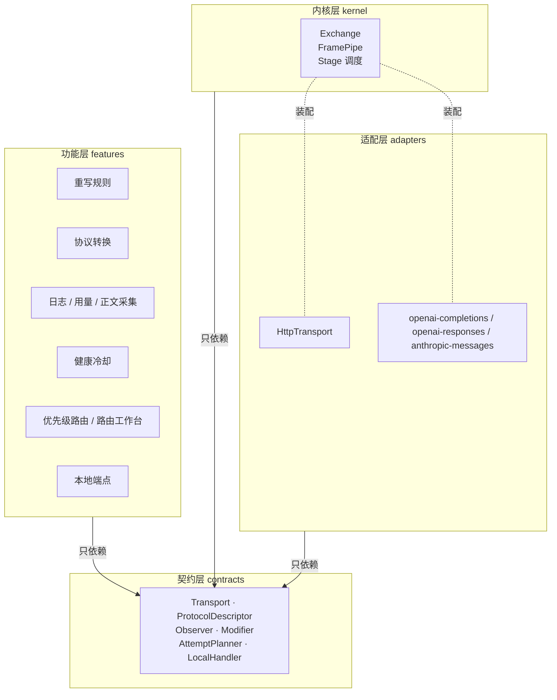
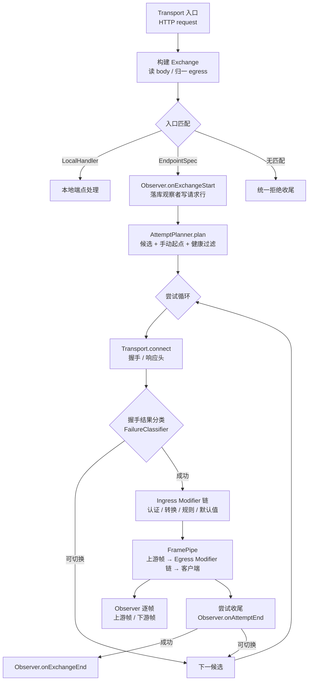

# 代理引擎设计：协议无关透传内核与扩展接口

## 定位

本文描述 `packages/core/source/proxy` 的结构。核心是一套**协议无关的透传内核**：默认只搬运字节与帧，不解析任何报文；「我们自己的功能」（请求/响应重写、协议转换、日志、用量、正文采集、健康冷却、路由策略）一律以插件形式挂在**观察接口**与**修改接口**上。

传输方式（HTTP、未来的其他方式）与接口形态（`chat/completions`、`embeddings`、`messages`、`responses`……）都作为**数据声明**进入注册表，内核里不出现任何协议名或传输名。

### 不变式：忠诚转发，不自适应

代理对上游只做一件事——把客户端的请求原样转过去；对客户端只做一件事——**按客户端跳声明的传输形态**把响应转回去。它不替上游兜底，也不替客户端补足。

因此「上游回的和我预期的形状不一样」只能有一个结论：**上游违约**。它应当作为一次失败被记录、按切换策略处理，而不是被就地改造成一个看起来能用的响应。**唯一**允许解析并改写报文的例外是显式协议转换器，而它的介入由规划期的 `(clientProtocol, upstreamProtocol)` 决定，与上游实际回了什么无关。

这条约束的理由不是「实现不了」，而是**一旦允许自适应，转发路径就不再可判定**：同一个客户端请求会因为它被发到哪台机器而得到不同的报文语义、不同的改写结果、不同的落库字段。自适应把「代理的行为」变成了「上游的实现细节」的函数，于是所有基于代理行为的推理——缓存、重放、审计、规则试跑、回放对比——都不再成立。

与既有文档的关系：

- [proxy.md](./proxy.md) 定义**行为契约**（协议识别、候选路由、自动切换、流式边界）。
- [protocol-conversion.md](./protocol-conversion.md) 的转换矩阵，在本文里落地为 `ProtocolDescriptor.conversion` 声明 + 一个 `Modifier` 实现。
- [outbound-proxy.md](./outbound-proxy.md) 不介入本文：出站代理属于 `infrastructure/network`，传输层直接复用。

## 一、传输形态

代理只认识**一根轴**：这一跳的字节在线上长什么样；协议是另一根轴（§2.3），两者互不约束。

### 1.1 一根轴：传输形态

把「这一跳用什么连接」与「客户端要不要边收边发」压成一个布尔量（`streamingRequest`）是不成立的：一条双向长连接上既没有请求体里的 `stream` 字段可解析，也不存在「上游是不是回了 SSE」的问题，可下游逻辑却仍要按预期走。

**只有一根轴**：`TransportKind` 的 `http` / `http-stream` / `websocket`。「连接方式」不是另一层领域概念——它就是 **URL scheme**（`wss://` 就是 WebSocket），不需要一个跟着每一跳复制的枚举；「客户端要不要流式」是同一档 `http-stream` 的线格式，不是另一档连接形态。

| 词 | 类型 | 取值 | 含义 | 从哪读出来 |
| --- | --- | --- | --- | --- |
| **协议** | `Protocol` | `openai-completions` / `openai-responses` / `anthropic-messages` | 报文怎么读 | 端点匹配（method + path） |
| **传输形态** | `TransportKind` | `http` / `http-stream` / `websocket` | 这一跳的字节在线上长什么样 | 客户端跳：封装描述；上游跳：URL scheme |

`TransportKind` 是**每一跳各自一个**的事实，两跳的读法不同但都不需要猜：

- **客户端跳**：入口认路径选出端点声明之后，读该端点的**唯一封装** `ProtocolEnvelope.resolveTransport(input)` —— 对 JSON 封装就是看请求体里的 `stream` 字段（`stream: true` → `http-stream`，否则 `http`）。它是**事实陈述**，不是凭印象写死的假设；返回取值而不是 `boolean`，调用方不必自己把 `true` 翻译成 `'http-stream'`，也就不会有两处翻得不一样。
- **上游跳**：`routing/upstream-url.ts` 的 `resolveUpstreamTransport(url, 客户端形态)` —— `wss://` / `ws://` 得 `websocket`，否则**镜像客户端跳**。镜像不是「客户端偏好决定上游」，而是**忠实转发**：我们原样把 `stream` 字段转发过去（`native-adapter.ts` 的 `prepareRequest` 只重写模型名），客户端要什么形态就发什么形态，上游该回什么由它自己那份请求决定。

**实现层怎么表达「连接方式」**：传输实现自己声明它服务哪几档——`transports/http.ts` 写 `transports: ['http', 'http-stream']`。这两档在建连、TLS、超时、abort、出网方式上**一字不差**（该文件全文不读响应头），差别只在响应体怎么分帧，而那是**封装**的属性。因此同一条 HTTP 实现天然覆盖两档，不需要两套执行器，也不存在「把流式需求漏进连接层」的机会。

`'websocket'` 是词表里**唯一一个「已声明但未实现」**的取值，所有拒绝点都收敛到传输注册表：`transports/registry.ts` 抛错（WebSocket 传输尚未实现，规划器不应产出 websocket 候选）、`runtime/proxy-runtime.ts` 回 `TRANSPORT_NOT_IMPLEMENTED`、`target-planner.ts` 用 `isWebSocketEndpoint()` 拒绝跨形态转换。保留它不为了兼容，而是为了**让拒绝有地方发生**——把不支持的形态写进词表，比让它以「解析失败」的形式出现更好查。

**两条硬约束**：

1. **客户端跳的形态不能喂给规划器**。客户端偏好从不改变哪个上游端点合法，客户端跳的取值只该留在客户端跳：`PlannerInput` 里没有任何传输字段，`UpstreamTarget` 也只剩地址，上游形态在每次尝试前用 `resolveUpstreamTransport(target.url, context.transport)` 现算。
2. **响应头只能校验，不能决定做什么**。见 §1.2。

**预期与事实分持**：

- `TransportKind`（客户端跳的 `exchange.transport`）：**预期**。客户端要流式还是非流式，入口解析请求体时就已经定下；
- `isEventStreamResponse(headers)`：**事实**。上游响应的分帧格式（读 `content-type: text/event-stream`）。SSE 是**格式**，不是一种传输，因此判定留在帧层；
- **两者是否一致** → 一个**比较**的结果，而不是一个可被反复读取、可以常驻的合成量。

三类名字各不相同，因此不会互相顶替：

1. **客户端意图** → `TransportKind`（`ExchangeView.transport`、`RequestContext.transport`、`RequestLoggingInput.transport`）；
2. **上游格式** → `isEventStreamResponse(headers)`，只读响应头；
3. **两者是否一致** → `attempt-executor.ts` 里那一次比较（`context.transport === 'http-stream' && upstreamTransport !== 'http-stream'`），用完即弃。

**落库字段与轴同名**，不做投影、不留兼容别名（见 [data-model.md](./data-model.md)）：

- `request_logs.transport`：客户端跳的形态，即**预期**，原值落库（不是布尔）；
- `request_attempts.upstreamTransport`：上游这一跳实际是什么形态，即**事实**，没拿到响应时为 `null`——因此「上游没回」与「上游回了非流式」在库里是两件事。

改写规则试跑接口的 `testCase.transport` 同样是轴上的取值：库里存的就是原生取值，读取端也不做投影或兼容别名，所以不存在「旧值」需要映射。

### 1.2 响应头不能决定「做什么」

「客户端要流式而上游回了整包 JSON」不能就地改造成一个看起来能用的响应（转换修改器改走 `accumulateWholeBody`、改写规则从「跳过」变成「介入」）——那样**同一个客户端请求会不会被改写规则改写，就取决于上游回了什么**。

按「定位」里的不变式，这里只能有一个结论：上游违约，报错并按切换策略处理。理由不是「实现不了合成事件流」，而是**我们不该合成它**。

出口的分派依据只有客户端跳的 `transport`（预期），响应头只用来选解析器与**校验**预期；两者不一致时该次尝试记 `transportMismatch` → 按切换策略换下一个候选，并打一条 `[proxy] transport mismatch …` 的告警。比较是**双向**的：客户端要非流式而收到 SSE、以及客户端要流式而收到整包，都算预期落空——只查一个方向时，「客户端没要流、上游硬塞流」这一类会被当成成功交给协议层解析。

**为什么预期不是响应期才知道的。** 「客户端要流式还是非流式」只在客户端跳存在，而上游跳根本没有这个声明——上游只会收到一个请求体。关键在于：我们**自己把 `stream` 字段转发过去**（`native-adapter.ts:13` 的 `prepareRequest` 只重写模型名，`stream` 原样透传），并且当我们转发 `stream: false` 时上游看到的就是 `stream: false`。因此：

| 客户端 `transport` | 我们转发给上游的 | 上游**应当**回的 | 上游回了另一个 |
| --- | --- | --- | --- |
| `http-stream` | `stream: true` | SSE 分帧 | 上游违约 |
| `http` | `stream: false` | 整包 JSON | 上游违约 |

两行对称：上游回了另一个，都是它没有按我们转发的请求作答。**没有哪一行需要代它兜底。** 于是：

- **预期**在规划期就定了（客户端 `transport` + 接口封装描述）；
- **事实**在响应期得到（`isEventStreamResponse(headers)`）；
- 响应头的唯一用途是**校验预期**，不是**决定做什么**。

**因此出口不存在「预期 ∧ 事实」的合成量。** 每一个调用点上正确的输入都是其中**某一个半边**：

| 调用点 | 需要的是哪半边 | 取值 |
| --- | --- | --- |
| `http-response-sink.ts` 出口是否边收边发 | 预期（客户端跳 `transport`） | 构造时传入的 `transport` ✅ |
| `attempt-observer.ts` 正文快照存什么形状 | 预期（客户端跳 `transport`） | `exchange.transport` ✅ |
| `downstream-head` 要不要删 `content-length` | 预期（客户端跳 `transport`） | `context.exchange.transport` ✅ |
| `response-rewrite` 规则要不要跳过 | 预期（客户端跳 `transport`） | 声明 `scope.transports: ['http']`，内核直接排除 ✅ |
| `protocol-conversion` 用哪个解析器 | 事实（`isEventStreamResponse`） | `isEventStreamResponse(head.headers)` ✅ |
| `request_attempts.upstreamTransport` 落库 | 事实（`isEventStreamResponse`） | `isEventStreamResponse(head.headers)` ✅ |

「预期落空」本身成了一个显式的失败状态：响应是 2xx、但响应头里的流式形态与客户端声明的 `transport` 不符（客户端要流式却拿到整包，或客户端要非流式却拿到 SSE）时，执行器记 `transportMismatch`，按 failover 换下一个候选，并按 `provider-model` 记一次健康失败（上游违约是上游的事，不该算成客户端的错，也不该算成这个模型「健康但没用」）。

「两者是否一致」是**一次比较**，用完即弃：不需要任何常驻的合成量。

## 二、目标架构

### 2.1 分层



依赖规则：**箭头单向向上**。`contracts` 不依赖任何实现；`kernel` 不 import `node:http`、不 import 任何具体协议、不 import 数据库；`features` 不互相 import。

### 2.2 核心抽象

| 抽象 | 职责 | 现有功能落位 |
| --- | --- | --- |
| `Exchange` | 一次客户端交互的全部状态（请求、响应出口、协议、候选、尝试、扩展字段） | 取代 `RequestContext` + `request-entry` 的散装状态 |
| `Frame` | 唯一的搬运单位（head / data / end / error / close） | 取代「Buffer + SSE 字符串 + 布尔 isStreaming」 |
| `Transport` | 唯一的对外出口（HTTP 单工；双向由 `UpstreamConnection.outbound` 表达） | 取代 `response/transport.ts` |
| `ProtocolDescriptor` | 协议的声明式元数据（匹配、信封、认证、用量、转换能力） | 取代 6 处协议矩阵 + `createAuthHeaders` switch |
| `EndpointSpec` | **一个接口**的声明（如 `/v1/embeddings`） | 取代 `routes.ts` + `request-defaults.ts` |
| `Observer` | 只读观察接口（逐帧、逐尝试、逐交换） | 取代 `observability/hooks.ts` |
| `Modifier` | 读写修改接口（请求方向 / 响应方向，可选逐帧） | 取代重写规则、协议转换、认证注入、默认值注入 |
| `AttemptPlanner` | 产出候选序列（按上游端点的协议与地址筛选） | 取代 `routing/router.ts` + `routing/routing.ts` |
| `LocalHandler` | 本地端点，不透传上游 | 取代 `proxy-runtime.ts` 里硬编码的 `/v1/models` |

### 2.3 两根正交轴：Protocol × 传输形态

整套设计只有一个形状：

```
ingress(protocol, 客户端跳形态) ──protocol→protocol 转换──► egress(protocol, 上游跳形态)
```

**协议与传输形态是两根互不约束的轴**，中间只做协议到协议的转换，**没有形态到形态的转换**——上游地址是 `wss://` 就是 WebSocket，是 `https://` 就照客户端跳的形态转发；没有任何一步会把「流式」变成「非流式」或反过来（那正是 §1.2 禁止的兜底行为）。

这个形状能成立，靠的是三件事实：

1. **形态不进入接口身份**。一个接口声明的是一份封装（`EndpointSpec.envelope`），`EndpointSpec.id` 不随形态变。四大接口各自只声明一份封装：把一个接口写成「每档形态各一套封装」的 map，或把形态写进 id（`responses` vs `responses-websocket`），都会让「一个接口有两种形态」看起来像「两个接口」，每加一档就要复制一遍匹配、模型名位置、用量结构。
2. **形态不是匹配条件**。`RouteMatcher` 只有 `(method, path)`。原因不是「入口拿不到形态」，而是**入口不需要它**：形态是它**读出来**的结果（`Envelope.resolveTransport` 读请求体），不是它用来筛接口的条件。同一个 `(method, path)` 上要收两种形态时，形态的差异由封装自己表达，不需要写两条规则——把形态写成匹配条件，只会让每个接口都多一条恒真的声明。
3. **内核只搬运**。`kernel/**` 里没有任何形态概念：`pipeFrames` 拿到的只是一个 `AsyncIterable<Frame>`，双向与否只体现为「有没有 `outbound`」。

#### 2.3.1 两跳各算各的形态

形态是**每一跳各自的事实**，两跳各有各的来源：

- **客户端跳**：入口认路径选出 `EndpointSpec` 之后，读它的封装 `resolveTransport(input)`（JSON 封装看请求体里的 `stream`）；
- **上游跳**：`resolveUpstreamTransport(target.url, 客户端跳形态)`——`wss://` 得 `websocket`，否则镜像客户端跳。

**上游目标上不存形态。** `UpstreamTarget` 只有地址，没有形态字段：形态是每次尝试前现算的，存一份只会多一个会漂移的副本。规划器唯一需要知道的形态事实是「这个端点的地址是不是 WS」（`isWebSocketEndpoint`），用来拒绝跨形态的协议转换。

`PlannerInput` 只有 `logicalModelId` / `clientProtocol` / `manualModelId`：上游形态由端点**自己配置的地址**与客户端跳现算，客户端偏好在类型上就没有到达上游侧的路。

出口侧的原子不是「协议」也不是「形态」，而是**地址与协议这一组事实**：`(protocol, url)`。这一点在 `UpstreamTarget` 上直接可见——规划器产出这两个字段，执行器据此去 `transports/registry.ts` 取实现。协议唯一决定的是**转换可行性**（只放行原生支持该协议的候选），不决定**内容**。

因此「新增一种传输形态」的全部代价是：扩展 `@common/schemas` 的词表 + 实现 `Transport` 接口（用 `transports: [...]` 声明它服务哪几档）+ 在 `transports/registry.ts` 里加一个分支。内核、协议、修改器、观察者都不需要改。

> 这套判断在代码里有逐字的落地说明，改之前先读：`contracts/transport.ts`（`outbound` 存在即双向、`transports` 是能力声明）、`contracts/route-matcher.ts`（为什么形态不是匹配条件）、`kernel/relay.ts`（双向交换复用单工尝试的收尾规则）。

## 三、契约定义

以下为 `packages/core/source/proxy/contracts/` 应包含的全部类型。类型定义即为接口文档，实现不得扩张契约。

> 契约文件：`contracts/frame.ts`、`exchange.ts`、`transport.ts`、`modifier.ts`、`observer.ts`、`protocol.ts`、`planner.ts`、`local-handler.ts`、`route-matcher.ts`、`headers.ts`（+ `index.ts` barrel）。
> `ExchangeView.transport` 是客户端跳的传输形态，也是全仓唯一的传输字段名（§1.1）。
> 依赖方向是硬的：实现只 import `@server/proxy/contracts`，契约层不 import 任何实现。下方代码块是设计说明，字段以代码为准。

### 3.1 Frame：唯一的搬运单位

```ts
/** 传输层搬运动作的最小单位。HTTP 与 WS 都归一到这五种。 */
export type Frame =
  /** 响应头 / 握手结果。HTTP 是 status+headers，WS 是 upgrade 结果。 */
  | { kind: 'head', status: number, headers: HeaderMap }
  /** 数据。永远是字节，不做编码假设；text 仅供需要解析的 Modifier 懒解码。 */
  | { kind: 'data', body: Buffer }
  /** 正常结束。 */
  | { kind: 'end' }
  /** 传输层错误。 */
  | { kind: 'error', error: Error }
  /** 对端关闭（WS 的 close 帧）。 */
  | { kind: 'close', code?: number, reason?: string }
```

约束：

- 内核**只做** `upstream.frames → egress` 的搬运；不解析 `data.body`。
- 唯一的解析入口是 `Modifier`。没有匹配的 Modifier 时，字节原样过去——这就是「零协议转换」原则在结构上的落地。
- 二进制安全：`Buffer` 不做任何 `toString('utf8')`，避免当前实现对非文本流（图片、音频）的隐性破坏。

### 3.2 Transport：唯一的出口

```ts
export interface UpstreamTarget {
  /** 端点标识，来自 EndpointSpec。 */
  endpointId: string
  protocol: Protocol
  url: string                       // 上游形态由地址 scheme 与客户端跳现算，不存在这里
  credentialRef: string | null
  customAuthHeader: string | null
  timeoutMilliseconds: number
}

export interface UpstreamConnection {
  /** 上游帧。HTTP 为 head/data*/end，WS 为持续的双向帧。 */
  readonly frames: AsyncIterable<Frame>
  /** 写入侧。只有双向传输提供，HTTP 不提供——「HTTP 是单工」因此是类型事实而不是约定。 */
  readonly outbound?: FrameSink
  /** 主动断开。幂等：内核保证一条连接只被 abort 一次。 */
  abort(): void
}

export interface Transport {
  /** 这个实现服务哪几档传输形态。分支的唯一处是 `transports/registry.ts`。 */
  readonly transports: readonly TransportKind[]
  connect(target: UpstreamTarget, exchange: ExchangeView, attempt: AttemptView): Promise<UpstreamConnection>
}
```

要点：

- **`connect` 是唯一需要实现的出口**。HTTP 实现返回没有 `outbound` 的连接；双向传输（当前未实现）返回带 `outbound` 的连接。内核不区分两者，只按「有没有 `outbound`」决定要不要跑反向管道。
- **`UpstreamTarget` 上不存形态**：形态是每次尝试前用 `resolveUpstreamTransport(target.url, 客户端跳形态)` 现算的，存一份只会多一个会漂移的副本。执行器据此去 `transports/registry.ts` 取实现（`resolveTransportImplementation`）——它没有权利自己选传输实现，那会把一个已声明的字段变成装饰。
- **一个实现可以服务多档**：`transports/http.ts` 写 `transports: ['http', 'http-stream']`，因为这两档在建连、TLS、超时、abort、出网方式上一字不差（实现全文不读响应头）。能力写在类型上，注册表不必再去比对一次。
- 能力声明不在 `Transport` 上：规划器判断「这个候选能不能服务这条入口」用的是 `EndpointSpec.envelope` 与 `resolveUpstreamTransport`，不是传输实现的字段。声明与实现分离，规划因此不需要实例化任何传输。
- 出站代理（[outbound-proxy.md](./outbound-proxy.md)）、TLS、DNS、空闲超时全部收在传输实现内，内核不知道它们存在。

### 3.3 ProtocolDescriptor 与 EndpointSpec：协议是数据

```ts
export interface ProtocolDescriptor {
  readonly id: Protocol
  /** 入口路由：方法 + 路径，注册表用它做协议识别。 */
  readonly routes: readonly ProtocolRoute[]
  /** 构造该协议的全部适配器。 */
  createAdapters(): readonly ProtocolAdapter[]
  /**
   * 逐接口声明：每个接口自己承担入口匹配与封装描述。
   * 认证与转换能力不在这里重复声明：它们必须被代理、管理端与渲染进程共用，
   * 因此住在 @common/protocols（PROTOCOL_AUTH_PRESETS / CONVERTIBLE_PROTOCOLS），
   * 注册表按 id 转发；目标形态是 auth(input) / convertibleTo / usage / failure。
   */
  readonly endpoints?: readonly EndpointSpec[]
}

/**
 * 一个接口。注意粒度是「接口」而不是「协议」：
 * /v1/chat/completions 与 /v1/embeddings 同属 openai-completions，
 * 但信封（模型名位置、流式语义、usage 结构）不同。
 */
export interface EndpointSpec {
  readonly id: string                     // 'openai-completions.chat'
  /** 入口匹配。支持方法、路径模式、必需的 header。 */
  readonly match: readonly RouteMatcher[]
  /** 该类请求的默认修改器（如 stream 请求注入 include_usage）。 */
  readonly modifiers?: readonly ModifierRef[]
  /** 该接口的请求封装。一对一，不是 map：形态的差别在响应体怎么分帧，不在请求封装。 */
  readonly envelope: ProtocolEnvelope
}

export interface RouteMatcher {
  method: HttpMethod | '*'
  path: string | RegExp
  /**
   * 额外条件（如必需的 header）。
   *
   * **没有形态字段**：入口不需要用它筛接口——形态是入口读出来的结果
   * （`Envelope.resolveTransport`），不是筛选条件。同一个 `(method, path)` 上要收两种
   * 形态时，差异由封装自己表达，不需要写两条规则。
   */
  headers?: Readonly<Record<string, string | RegExp>>
}

/**
 * 封装：协议与接口的差异，全部收敛到这三个问题。
 *
 * 注意这里**只有请求侧的形态、没有「响应是否流式」**：上游响应分帧是帧层的事实，
 * 与协议无关，任何一个封装描述都不该重复实现一遍。
 */
export interface ProtocolEnvelope {
  /** 报文编码。binary 的封装不允许默认值注入与 JSON 改写。 */
  readonly body: 'json' | 'binary'
  /** 客户端想用的模型名在哪里？（body.model / path 段 / header）读不到返回失败原因，而不是 null。 */
  readModel(input: EnvelopeInput): ProtocolModelReadResult
  /** 把模型名写回去。HTTP 写 body，Gemini 类走 path 的接口写 url。 */
  writeModel(input: EnvelopeInput, modelName: string): EnvelopeWriteResult
  /**
   * 本次请求在**客户端跳**的传输形态（`TransportKind`）。
   * 返回轴上的取值而非 boolean：调用方直接把它当作请求级事实往下传。
   */
  resolveTransport(input: EnvelopeInput): TransportKind
}
```

`ProtocolEnvelope` 是「各种接口的支持」的落点：新增一个接口 = 新增一个 `EndpointSpec`（声明匹配、模型名位置、形态解析），不需要动内核，也不需要改其他协议。

### 3.4 Observer：观察接口

```ts
export interface Observer {
  readonly id: string
  /** 执行顺序，小的先。落库型观察者用小值，依赖落库结果的观察者用大值。 */
  readonly order?: number

  onExchangeStart?(event: { exchange: ExchangeView }): void | Promise<void>
  onAttemptStart?(event: { exchange: ExchangeView, attempt: AttemptView }): void | Promise<void>
  onUpstreamFrame?(event: { exchange: ExchangeView, attempt: AttemptView, frame: Frame }): void | Promise<void>
  onDownstreamFrame?(event: { exchange: ExchangeView, attempt: AttemptView, frame: Frame }): void | Promise<void>
  onAttemptEnd?(event: { exchange: ExchangeView, attempt: AttemptView, result: AttemptResult }): void | Promise<void>
  onExchangeEnd?(event: { exchange: ExchangeView, result: ExchangeResult }): void | Promise<void>
}
```

契约（必须由内核强制，不能靠约定）：

1. **只读**。载荷里的 `ExchangeView` / `AttemptView` 是冻结视图，不含可变的 headers 与 body 引用。观察者想改内容必须去写 `Modifier`，从类型上就区分开。
2. **错误隔离**。观察者抛错只记 `console.error`，绝不改变请求结果。观察能力失效不能导致代理不可用。
3. **不阻塞主链**。`onUpstreamFrame` / `onDownstreamFrame` 的返回值不与数据流背压挂钩；需要保证「已落库」的消费者用 `order` 排在落库观察者之后。
4. **落库责任自持**。当前「回调必须在落库之后」这一条由 `LoggingObserver.onExchangeStart` 自己保证：它先写请求行，再把 ID 放进 `exchange.state`，后续观察者读 `state` 而不是再回查数据库是否存在。

现有观察能力的落位：`observers/request-log.ts`（请求行）、`observers/attempt-log.ts`（尝试行）、`observers/content-capture.ts`（正文）、`observers/usage.ts`（用量）、`observers/health.ts`（成功/失败计数）、`observers/live-tail.ts`（管理端实时订阅）。

### 3.5 Modifier：修改接口

```ts
export type ModifierDirection = 'ingress' | 'egress'

/** 修改器在数据流上的工作方式。它决定了内核是否为它缓冲。 */
export type ModifierFrameMode =
  /** 只处理完整报文。内核会把流缓冲成一个 Buffer 再交给它。 */
  | 'buffered'
  /** 逐帧处理。真正支持流式改写的方式。 */
  | 'frame'
  /**
   * 本传输/接口下不参与。
   *
   * 这是**声明性**的：内核按它排除该修改器，观察者据此记「本规则在本传输下未生效」。
   * 它与「`match` 返回 false」的区别在语义而不在效果——前者说「这里根本没有它能做的事」，
   * 后者说「这次请求不满足它的条件」。
   */
  | 'skip'

export interface Modifier {
  readonly id: string
  readonly direction: ModifierDirection
  readonly frameMode: ModifierFrameMode
  readonly order?: number

  match(ctx: ModifierContext): boolean

  /** frameMode === 'buffered' 时调用。返回 null 表示不改。 */
  applyBuffered?(ctx: ModifierContext, payload: BufferedPayload): BufferedPayload | null | Promise<BufferedPayload | null>

  /** frameMode === 'frame' 时调用。返回 null 表示丢弃该帧，返回数组表示展开。 */
  applyFrame?(ctx: ModifierContext, frame: Frame): Frame | readonly Frame[] | null | Promise<Frame | readonly Frame[] | null>
}

export interface ModifierContext {
  exchange: ExchangeView
  attempt: AttemptView
  direction: ModifierDirection
  /** 上游响应头。null 表示还没拿到响应。它只用来选解析器与校验预期（§1.2）。 */
  upstreamHead: HeadFrame | null
  /** 本次修改器负责的协议对。协议转换器用得到，普通修改器可忽略。 */
  protocols: { client: Protocol, upstream: Protocol }
}

/** 修改器声明的适用范围。声明式：内核按它排除，修改器自己不必再判断。 */
export interface ModifierScope {
  /** **客户端跳**的传输形态。省略表示不限。 */
  readonly transports?: readonly TransportKind[]
}
```

设计要点：

1. **`frameMode` 决定是否缓冲**。内核的策略是：只有当「有匹配的 `buffered` 修改器」时才把流收成一个 Buffer。没有匹配者时数据**逐帧透传**，不做任何聚合——这直接继承了 `proxy.md` 的「流式不缓冲」原则，并且把当前「流式一律 skip 规则」的硬限制变成了**每个规则自己声明能力**。
2. **`frame` 是流式改写与流式转换的统一形式**。当前 `StreamConverter { push, flush, finish }` 增量解析 SSE 的做法，落位为一个 `frameMode: 'frame'` 的转换修改器，内部状态由它自己持有。
3. **失败语义显式**。修改器抛错 → 内核产出带 `modifierId` 的 `ModifierError`；由 `AttemptPlanner` / 切换策略决定「本次尝试失败并切换」还是「直接回客户端 4xx」。当前 `RequestRewriteError` 被硬编码成 422 的分支（`attempt-executor.ts` 的 `onError`），就是这个语义被写死在内核里的后果。
4. **`skip` 必须显式声明而不是静默跳过**。观察者需要知道「本规则在本形态下未生效」，才能如实写日志。
5. **修改器不得用上游响应头决定「做什么」**。响应头只能用来选**解析器**（手里这堆字节是 SSE 还是整包 JSON），不能用来决定形态、能不能改写、要不要跳过。一旦允许，改写规则是否生效就变成了上游实现细节的函数——同一条规则、同一个请求，换台机器结果不同（见 §1.2）。需要按形态分流时读 `context.exchange.transport`（**预期**），需要确认上游是否兑现时读 `context.upstreamHead`（**事实**），两者不一致是失败，不是分支。
6. **能排除的形态是声明出来的**。`ModifierScope.transports` 是静态能力声明：内核在选候选时就按它排除，修改器自己不必再判断这根轴——这正是「hooks 基于 protocol 与 transport 处理数据，且不需要自己去判断」的落地方式。它与 `match` 的分工是语义而不是效果：前者说「这种形态下根本没有它能做的事」（结论要进日志），后者说「这一条请求不满足它的条件」。今天只有 `response-rewrite` 声明了 `scope: { transports: ['http'] }`——说的就是「只有非流式那一档才有它能做的事」；请求侧的三个修改器都不声明，因为形态说的是响应怎么回来，而请求总是整份读完再发，没有哪个形态能让他们无事可做。
现有修改能力的落位：`modifiers/auth.ts`（认证头注入）、`modifiers/endpoint-defaults.ts`（`include_usage` 等接口默认值）、`modifiers/protocol-conversion.ts`（协议转换，一对 ingress/egress）、`modifiers/rewrite-rules.ts`（请求重写规则，`buffered` 或 `frame`）。

### 3.6 AttemptPlanner 与 LocalHandler：两个装配点

```ts
export interface AttemptPlanner {
  readonly id: string
  plan(input: {
    exchange: ExchangeView
    logicalModelId: string
    /** 本次交换的客户端跳形态（§1.1）。上游形态由端点地址与它现算，不在这里。 */
    transport: TransportKind
    /** 允许的协议对：客户端协议 + 可转换到的协议。 */
    acceptedProtocols: readonly Protocol[]
  }): Promise<PlanResult>
}

export interface PlanResult {
  targets: readonly UpstreamTarget[]
  /** 无法成行时的原因，用于生成客户端错误信息，不再靠调用方拼字符串。 */
  rejection?: { code: string, message: string }
}
```

- 今天的 `resolveProxyTargets`（优先级排序 + 手动切换 + 健康过滤）成为 `planners/target-planner.ts`。
- 健康冷却由 `upstream/health` 写、`routing/router` 读，规划器只消费 `getAvailableModels` 的结果：它自己不查冷却状态。
- [route-design.md](./route-design.md) / [workflow-engine.md](./workflow-engine.md) 的路由工作台成为 `planners/workflow-planner.ts`，**不 fork 引擎**。

**实际形态比上面的草案更窄**（草案里的 `exchange` / `acceptedProtocols` 收窄成了单个字段）：

```ts
export interface PlannerInput {
  readonly logicalModelId: string
  readonly clientProtocol: Protocol
  readonly manualModelId: string | null
}

export interface PlanResult {
  readonly targets: readonly UpstreamTarget[]
  readonly reason: 'none' | 'model-not-configured' | 'manual-model-unavailable' | 'no-available-provider'
  /** 候选为空时的用户可见说明；入口用它拼错误信息，不再自己猜原因。 */
  readonly detail?: string
}
```

- 传入 `manualModelId` 而不是让入口先去 `routing/router` 过滤：手动锁定是路由决策，不是请求解析。
- 传入 `clientProtocol` 而不是让入口自己先筛一遍端点：入口因此不必知道「哪种协议下哪些端点合法」——那是注册表与规划器的职责，规划器只消费结论。「可转换端点不能指向 WS 地址」这一条也留在规划器里（`isWebSocketEndpoint`），因为那是上游侧的事实，入口没有资格替它决定。WS 与「可转换」不相容的原因不是能力不足，而是**跨形态转换不在支持范围内**：我们只做协议→协议的转换，不做形态→形态的转换。
- `detail` 让「为什么没有候选」的措辞只有一处，入口不再自己拼。
- 执行器与收尾器只消费 `UpstreamTarget`，不接触 `ProviderModel` / `Provider`：每次尝试的投影（`toAttemptSnapshot()`）在 `observability/attempt-log-collector.ts`，模型端点标识在规划器里。
- 上游地址解析只有一处：`routing/upstream-url.ts`。
- `buildUpstreamTarget()` 对外开第二个口：设置页的「测试连接」只有一个模型要测、没有候选可排，与批量规划共用同一处字段映射。
- **`ExchangeView.transport` 是客户端跳的显式事实（§1.1）**。规划器看不见也不需要看见 `stream: true`，因此「客户端偏好」的取值绝不能变成路由输入；把它做成一根显式命名的轴（而非布尔），是让这件事从字面上就能看出来。它**只在客户端跳**：上游跳的形态由 `resolveUpstreamTransport` 从地址现算，不进 `PlannerInput`（§2.3.1）。

```ts
export interface LocalHandler {
  readonly id: string
  readonly match: readonly RouteMatcher[]
  handle(exchange: ExchangeView, egress: EgressWriter): Promise<void>
}
```

- `/v1/models` 成为 `local-handlers/models.ts`；未来的 `/healthz`、`/metrics`、`/v1/live` 同样注册即可。
- 内核的入口匹配一次做完：先匹配 `LocalHandler`，再匹配 `EndpointSpec`，都不中才回 404（且走统一的拒绝收尾）。

本地端点是声明式注册：`proxy/local/` 的 `LocalEndpoint { method, path, handle(input) }`，`/v1/models` 是它的第一个用户，`runtime/proxy-runtime.ts` 里没有任何路径字面量。上面那版 `LocalHandler`（`match: RouteMatcher[]` + `ExchangeView/EgressWriter`）是更宽的目标形态：等 `Exchange` 与 `EgressWriter` 存在，`LocalEndpoint.handle` 的入参从 `{ request, response }` 换成它们即可，声明与匹配部分不需要再动。

## 四、一次请求的执行流



与落库那条线**并排**还有一条内存线，专供界面看「此刻」：请求入口登记一份台账记录，执行器每次尝试产出进度（字节、分片、首字、输出 Token），收尾器在落库的同时把它移出台账。两个观察者挂在同一个 `observers` 数组上、互不依赖——其中一个抛错只丢自己那条记录。台账不参与搬运，也不参与交付判定（状态码与上游形态由执行器写，因为「要不要交付」的判断也在那里，事实与判断必须落在同一处）。细节见[可观测性 · 进行中的请求](observability.md#进行中的请求内存态)。

双向传输的能力仍预留在内核里，但**没有实现，也不在当前计划内**：

| 预留点 | 位置 | 说明 |
| --- | --- | --- |
| 词表取值 | `@common/schemas` 的 `TransportKind` | `'websocket'` 是已声明的取值，但没有任何传输实现声明服务它 |
| 双向插座 | `contracts/transport.ts` 的 `UpstreamConnection.outbound` | 存在即双向；HTTP 不提供，所以「HTTP 是单工」是类型事实而不是约定 |
| 双向搬运与收尾 | `kernel/relay.ts` 的 `relayConnected` | 与单工的 `relayAttempt` 共用 `runRelay`，统一处理「谁先结束」（`firstEnded`）、反向摘要（`inbound`）与「上游只断一次」；当前没有生产调用者（测试在 `kernel/relay.test.ts`） |
| 未实现传输的显式拒绝 | `transports/registry.ts` | 没有实现声明服务 `'websocket'` 时直接抛错，不静默回退到 HTTP——静默回退会拿一个 WS 地址去发 HTTP 请求 |
| 升级请求的显式拒绝 | `runtime/proxy-runtime.ts` | `server.on('upgrade')` 回 501 `TRANSPORT_NOT_IMPLEMENTED`（`UNSUPPORTED_TRANSPORT_RESPONSE`）；不注册监听器会让 Node 直接销毁 socket，客户端只能看到「连接失败」 |

保留这五处的代价只有注释与一个永不触发的分支；收益是将来真要加一条双向传输时，`proxy/kernel/**` 不需要改写搬运与收尾规则。

## 五、已钉在测试上的不变式

> 标记含义：[x] 表示已由自动化测试或 `pnpm lint` / `pnpm typecheck` 门控覆盖。

- [x] `proxy/contracts/` 只含类型，`proxy/kernel/` 无 `node:http`、无协议名、无数据库依赖，`packages/core/scripts/check-proxy-layers.mjs` 通过
- [x] 新增一个协议只需新增 `protocols/<id>/descriptor.ts` 一个文件，不改内核、不改其他协议
- [x] 新增一个接口只需在已有协议目录里新增一个 `EndpointSpec`（注册表的匹配、封装查找与拒绝路径都由声明驱动，不需要改注册表代码）
- [x] 新增一档传输形态只需扩展 `TransportKind` 词表 + 实现 `Transport`（用 `transports: [...]` 声明服务哪几档，`transports/registry.ts` 自动发现），不改内核、不改任何 Modifier/Observer（实现按 `resolveUpstreamTransport(target.url, exchange.transport)` 选取）
- [x] 新增一个观察能力只需注册 `Observer`，不改内核；观察者抛错不影响请求结果，且**逐个隔离**：`kernel/relay.ts` 的 `notifyObservers` 一个观察者一个 try/catch，抛错的只留一条告警，它之后的观察者照样收到通知（`kernel/relay.test.ts` 断言抛错观察者后面的那个拿到了 `start` 与 `end`）
- [x] 新增一个修改能力只需注册 `Modifier`，不改内核；未匹配修改器时字节逐帧透传
- [x] 无匹配的 `buffered` 修改器时，流式响应不做任何缓冲（与 [proxy.md](./proxy.md) 行为一致）
- [x] `attempt-executor.ts` 保留为候选循环编排，帧搬运在 `kernel/relay.ts`（有意的分工，不是待办）
- [x] HTTP 路径（`chat/completions`、`completions`、`embeddings`、`messages`、`responses`）行为与 [proxy.md](./proxy.md) 的契约一致
- [x] 形态不进入接口身份：`openai-responses` 只有 `responses` 一个 endpoint（`match` 里两条入口路由都不带形态条件），不存在 `responses-websocket` 这样的 id（`registry.test.ts`）
- [x] 形态不是匹配条件：`RouteMatcher` 只有 `(method, path)`，封装描述里没有形态字段；同一个 `(method, path)` 会同时接受 `http` 与 `http-stream`（形态由 `Envelope.resolveTransport` 从请求体读出，`json-envelope.test.ts` 断言 `stream: true` → `http-stream`）
- [x] 客户端跳的形态是显式事实：`ExchangeView.transport` / `RequestContext.transport` 由入口从封装描述写入，`request-entry` 有断言
- [x] 双向交换与单工尝试共用同一份搬运与收尾：`relayAttempt` 与 `relayConnected` 共用 `runRelay`，上游只断一次是内核不变式（`kernel/relay.test.ts` 断言 abort 次数为 1）
- [x] `/v1/models` 由 `LocalHandler` 提供，`proxy-runtime.ts` 不再包含任何业务分支
- [x] 路由决策只有一处：`planners/target-planner.ts` 是 `AttemptPlanner` 的唯一实现，入口只把规划结果翻成拒绝码；执行器与传输层只见 `UpstreamTarget`（`target-planner.test.ts` 14 例覆盖原生优先、HTTP 转换候选、WS 仅原生、三种空候选原因、字段映射与坏 URL 不下传抛错）
- [x] 分层约束可执行：`packages/core/scripts/check-proxy-layers.mjs` 挂在 `pnpm lint` 里
- [x] 只有一根轴：`TransportKind` = `http` / `http-stream` / `websocket`，是全仓唯一的传输词表（`schemas.test.ts` 钉住词表，`transports/registry.ts` 的加载期断言钉住「每个声明的取值都有实现服务」）
- [x] 客户端跳的取值不进入上游跳：`PlannerInput` 没有 `transport` 字段，上游形态由 `resolveUpstreamTransport(target.url, exchange.transport)` 从端点地址现算（`upstream-url.test.ts` 断言 `wss://` / `ws://` → `websocket`，其余镜像客户端跳；`attempt-executor.test.ts` 断言 WS 端点不下传给转换候选）
- [x] 预期与事实两半分持：预期落空 → `transportMismatch` → failover，并按 `provider-model` 记健康失败（`response.test.ts` 断言 `classifyHealthFailure({ statusCode: 200, transportMismatch: true }) === 'provider-model'`）
- [x] 落库字段与轴同名、无投影：`request_logs.transport`（预期，客户端跳）、`request_attempts.upstreamTransport`（事实，TEXT 可空）
- [x] `modifiers/` 有自己的单测：`response-modifiers.test.ts`
- [x] 下游背压会被等待：`ResponseSink.write` 返回 `false` 时先等 `drain` 再算这一帧写完（`adapters/http-response-sink.test.ts`），客户端来不及收时不会把内存堆上去
- [x] 不向上游协商压缩：`createUpstreamRequestHeaders` 剥掉 `accept-encoding`（`response/headers.test.ts`）。整条链路上没有任何解压——协议转换、正文改写、失败归因与日志读的都是原始字节，HTTP 保证 `identity` 总是可接受的，要了压缩等于让上面每一步都去解析读不懂的字节
- [x] 请求头**默认转发**：`createUpstreamRequestHeaders` 不维护「允许转发」的白名单，客户端带了什么就转发什么，连名字的大小写都不动，只排除四类有理由的头——与位置绑定的 `host` / `content-length`、逐跳头与 `connection` 点名的头、客户端鉴权头、以及上一条的 `accept-encoding`。官方接口的自定义方言（`openai-beta`、`anthropic-beta`、`x-stainless-*`、`originator`、`session_id`、`x-goog-*`）因此不需要代理认识它们：代理猜不全，也不必猜——多带一个对方不认识的头最多无害，少带一个却是 400（`response/headers.test.ts` 的 `forwards unknown custom headers verbatim`）
- [x] 协议固定头**只补缺、不覆盖**：凭据落点与协议固定头分成 `replace` / `fill` 两半（`resolveProtocolAuthHeaders`）。客户端自己带了 `anthropic-version` 就用客户端的值，代理只在缺了这个头时补 `2023-06-01`——把两半合成一份就表达不出「该覆盖」与「该让位」的区别（`protocols.test.ts`、`response/headers.test.ts`）
- [x] 上游中途断连会变成一帧终止错误：`transports/http.ts` 监听响应的 `close`，在 `readableEnded` 为假时发一帧 `error`，而不是让下游等一个永远不会来的结尾（`transports/http.test.ts`）
- [x] 自定义鉴权头不吞掉协议固定头：`createProtocolAuthHeaders` 的自定义头分支保留 `preset.fixedHeaders`（例如 Anthropic 的 `anthropic-version`）（`protocols.test.ts`）

### 尚未实现的部分

- **WS 传输没有实现，也不在当前计划内**：没有任何接口声明 WS 专属封装，也没有 `transports/websocket*.ts` 这样的实现。保留下来的是**能力形状**：`TransportKind` 的 `'websocket'` 取值、`UpstreamConnection.outbound`、`kernel/relay.ts` 的 `relayConnected`，以及 `transports/registry.ts` / `runtime/proxy-runtime.ts` 对未实现形态的显式拒绝。因此「新增传输的代价是扩展词表 + 实现 `Transport` + 加一个分支」这条结论仍然成立，只是当前没有这个消费者。
- **`websocket` 取值只有声明没有实现**：「连接方式」不是领域概念——URL scheme 就是它（`wss://` / `ws://` → `websocket`，见 §1.1）。今天没有任何传输实现声明服务它，因此入口只会在 `upgrade` 请求上遇到它，而那里会得到 501。

## 六、开放问题

1. **修改器冲突语义**：两个同方向修改器改同一个字段时，是靠 `order` 后者胜，还是内核检测冲突并报错？倾向后者（显式），但需要确认重写规则与协议转换必然同时命中的场景。
2. **`frame` 修改器的背压**：改写是否允许改变帧的节奏（如把 1 个上游帧展开成多个下游帧）？会直接影响 SSE 客户端的解析假设。
3. **Exchange 状态的类型化**：观察者之间共享数据（如「请求行 ID」）用字符串键 `Map` 还是声明式扩展点？后者更安全但需要在契约里做泛型装配。
4. **`EndpointSpec` 的粒度上限**：`embeddings`、`images`、`audio` 是否需要各自的 `usage` / `failure` 语义，还是统一走协议级默认。
